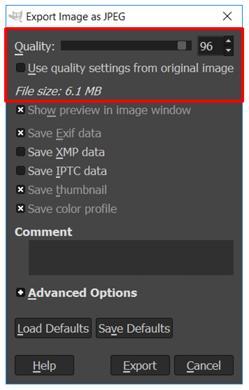

Час. Радно окружење програма за обраду растерске графике
==========================================================

.. infonote::
 
 На овом часу научићеш да:
    •	 обрађујеш и креираш растерску слику у изабраном програму;
    •	 користиш алате за уређивање и трансформацију слике.

Хајде да се подсетимо!

Питање: 
~~~~~~~

.. mchoice:: L32P1
    :answer_a: Приликом повећавања слика губи на квалитету
    :feedback_a: Тачно    
    :answer_b: Слика која се састоји од матрице/мреже појединачних тачака (пиксела)
    :feedback_b: Тачно
    :answer_c: Графика која заузима мање меморијског простора 
    :feedback_c: Нетачно
    :answer_d: Графика која заузима више меморијског простора
    :feedback_d: Тачно
    :answer_e: Слика се смањује и повећава без губитка 
    :feedback_e: Нетачно
    :correct: a,b,d

	Која од наведених тврђења карактеришу растерску графику? Означи све тачне одговоре.

.. technicalnote::

    У овом разреду, бавићемо се основним техникама измене дигиталних слика у програму за растерску графику Gimp 2. Овај програм је бесплатан за преузимање и коришћење и пружа бројне могућности за обраду и креирање дигиталне слике. Ради под оперативним системима Windows и Linux. 
    Да бисмо инсталирали Gimp 2 на кућном рачунару, потребно је да посетимо интернет страницу https://www.gimp.org/downloads/ и одатле покренемо инсталацију. 

    Поступак инсталације датог програма можеш да погледаш на доњем видеу:

    .. ytpopup:: -jSiYBv9WeU
        :width: 735
        :height: 415
        :align: center

Током ових часова бавићеш се обрадом (уређивањем) дигиталне слике користећи постојеће (скениране или преузете са интернета) или креиране употребом фото-апарата или дигиталних уређаја. 

Без обзира да ли су слике преузете са интернета, скениране или направљене дигиталним уређајем, већина растерских слика захтева неку врсту обраде пре употребе. То може бити или једноставно прилагођавање дигиталног формата (исецање, промена колор модела), ретуширање ради побољшања изгледа или уклањања недостатака, коришћење филтера којима се додају одређени ефекти, монтажа или комбиновање више слика за креирање сложених слика…

Основна подешавања 
------------------

Пре него што започнеш рад у програму за обраду и креирање растерске слике добро би било да извршиш нека једноставна подешавања програма. За то, можеш да користиш опцију Preferences из менија Edit. Oдабиром ове опције отвара се прозор у коме можеш да подесиш изглед радног окружења, странице (да ли ће бити транспарентна или не), затим можеш подесити мерне јединице и резолуцију, начин експортовања слике (одабереш подразумевани тип датотеке за експортовање), изглед помоћних линија (вођица) и мреже, додаш различите филтере, итд.

.. figure:: ../../_images/L32S2.png
    :width: 780px
    :align: center
    :class: screenshot-shadow

Кликом на дугме ОК потврђујеш измене које су начињене.

Отварање новог документа
------------------------ 

Креирање нове растерске слике врши се одабиром опције New из менија File. Одабиром ове опције отвара се прозор као на слици.

У падајућој листи Template дефинисане су димензије одређених стандардних формата као што су А0, А1, А3, А4, итд. 

У одељку Image Size можеш да дефинишеш ширину (Width) и висину (Height) новоформиране слике, која може бити приказана у пикселима, инчима, центиметрима итд. (мерну јединицу мењаш из падајуће листе). 

.. |opcija1| image:: ../../_images/L32S4.png
               :width: 50px

Ако одабереш стандардизован формат, на пример А4 формат, у пољима за ширину и висину биће аутоматски приказане вредности тог формата.

У овом прозору можеш да подесиш и оријентацију папира (платна) одабиром опција  Portrait и Landscape |opcija1|. Поред ове опције налази се дефинисана резолуција - у овом случају мисли се на густину пиксела на екрану. Већина монитора има оптималан графички приказ на 72 пиксела по инчу, међутим за штампмање било које врсте, нека устаљена вредност је 300 ppi (пиксела по инчу). То је због тога што људско око не може да примети разлику у квалитету слике изнад те цифре. 

Одабиром опције Advanced Options отвара се листа у којој наведене опције можеш прилагодити својим потребама. 

    
Можеш променити резолуцију, а такође и одабрати како ће позадина бити попуњена. Позадина може бити бела (*White*), провидна (*Transparent*) или можеш одабрати неку шару сачињену од више боја (*Pattern*). Tранспарентна позадина се може сачувати само у одређеним екстензијама, од којих су најчешће .gif и .png.

Важно је да знаш да се величина слике одређује на следећи начин:  физичка величина (cm) = димензије слике (пиксел) / резолуција екрана (ppi)*2,54. 

На пример: Слика дужине 200 пиксела (једна димензија слике!) на екрану са резолуцијом 72 ppi имаће дужину од 7,05 cm.

.. fillintheblank:: L32P2

    Колику ће дужину у центиметрима имати слика дужине 500 пиксела са резолуцијом од 300 ppi? Унеси вредност користећи запис са две десимале иза децималне тачке.

    Одговор: |blank|

    - :^4.23$: Тачно
      :x: Одговор није тачан.

Отварање постојеће слике
------------------------

Слику преузету са интернета, скенирану или направљену дигиталним уређајем, отввори у програму за обраду растерске графике одабиром опције File → Open. 

Одабиром ове опције отвара се прозор из кога бираш место, тачније фасциклу у којој је сачувана слика. Кликом на дугме Open отвориће се слика на којој можеш да примениш неколико различитих техника за уређивање исте.

Промена оријентације слике
---------------------------

Често се дешава да дигитална слика која је направљена дигиталним уређајем није окренута онако како желиш. 

Оријентацију слике можеш да мењаш тако што из менија Image одабереш опцију Transform. Одабиром ове опције отвориће се листа опција које можеш применити на слици, и то:

•	Flip Horizontally – одабиром ове опције слику преврћеш по хоризонтали;
•	Rotate :math: '180^o' – одабиром ове опције слику ротираш за 180 степени;
•	Rotate :math: '90^o' counter-clockwise – одабиром ове опције слику ротираш за 90 степени у смеру супротном од казаљке на сату;
•	Rotate :math: '90^o' clockwise - одабиром ове опције слику ротираш за 90 степени у смеру казаљке на сату;
•	Flip Vertically - одабиром ове опције слику преврћеш по вертикали.

Питање:
~~~~~~~

.. mchoice:: L32P3
    :answer_a: Flip Horizontally
    :feedback_a: Нетачно    
    :answer_b: Rotate :math:`180^o`
    :feedback_b: Нетачно
    :answer_c: Rotate :math:`90^o` counter-clockwise
    :feedback_c: Нетачно
    :answer_d: Rotate :math:`90^o` clockwise
    :feedback_d: Нетачно
    :answer_e: Flip Vertically
    :feedback_e: Тачно
    :correct: e

	Дата је оригинална слика. 
        
    .. figure:: ../../_images/L32S7.png
        :width: 200px
        :align: center

    Коју од техника треба применити тако да слика изгледа овако: 

    .. figure:: ../../_images/L32S6_1.png
        :width: 200px
        :align: center
    
    Означи тачан одговор.

Алатке за селекцију 
-------------------

У програму Gimp 2 постоји више алатки помоћу којих можеш да селектујеш (одабереш) жељени део слике. Све ове алатке се налазе у палети са алаткама – Toolbox (1), а можеш да их пронађеш и у оквиру менија Tools →  Selection Tools (2).

.. figure:: ../../_images/2.1.png
    :width: 800px
    :align: center
    :class: screenshot-shadow

.. |opcija6| image:: ../../_images/L32S14.png
               :width: 50px

Део слике можеш да селектујеш употребом алатки:

.. csv-table:: 
   :header: "**алатка**", "**опција**"
   :widths: auto
   :align: left
   
   "за правоугаону", "|opcija2|",
   "овалну (елипсоидну)", "|opcija3|",
   "селекцију слободним избором", "|opcija4|",
   "издвајањем пиксела који имају сличне особине (суседне области сличне боје)", "|opcija5|",
   "издвајањем пиксела који имају сличне особине (области исте боје на целој слици)", "|opcija6|",

Кликом на једну од приказаних алатки, на пример правоугаону селекцију испод кутије са алаткама, отвара се простор у коме је могуће подесити њена својства. 

Најважнија својства су:

­Mode (Режим) (1) – преклапање селекције (Прво дугме активира режим у коме се креирањем нове селекције уклања претходна, док друго дугме активира режим у коме се креирањем нове селекције задржава претходна) и
­Feather edges (Мекане ивице) (2) – фини прелаз између селектованог и неселектованог дела слике. Одабиром ове опције можеш подесити и угао за креирање меканих, паперјастих ивица.

У зависности од избора алатке могу се приказати и друга својства као што су:

Rounded corners (Заобљене ивице) (3),
­Expand from Center (Рашири из средишта) (4) и слично.

Селекцију у облику правоугаоника можеш да извршиш тако што одабереш алатку за правоугаону селекцију, притиснеш тастер R са тастатуре или одабереш опцију Tools → Selection Tools → Rectangle Select. Држећи притиснут примарни тастер миша, развлачиш правоугаоник до жељене величине и отпустиш тастер миша. Квадратну селекцију „исцртаваш“ на исти начин као што то радиш и код правоугаоне селекције, само што у исто време држиш и притиснут тастер Shift. Квадратну селекцију можеш да спроведеш ако подесиш својства задржавања односа Aspect ratio ширине и висине на 1:1, што значи да ће ширина и дужина селекције бити исте (5). 

.. figure:: ../../_images/L32S16.png
    :width: 300px
    :align: center

Овалну селекцију „исцртаваш“ тако што одабереш алатку за овалну селекцију (десним кликом на алатку за правоугаону селекцију отвара се падајућа листа из које бираш алатку), притиснеш тастер Е са тастатуре или одабереш опцију Tools → Selection Tools → Ellipse Select. Држећи притиснут примарни тастер миша, развучемо овални облик. Круг исцртавамо држећи притиснут тастер Shift или подешавањем својства задржавања односа ширине и висине 1:1.

Неправилан облик селекције спроводиш тако што одабереш алатку за селекцију слободним изоборм, притиснеш тастер F са тастатуре или одабереш опцију Tools → Selection Tools → Free Select. Ову алатку примењујеш тако што поставиш курсор на део слике који желиш да селектујеш, држиш притиснут примарни тастер миша и исцртаваш жељени облик. Да би облик био затворен, процес селектовања мораш да завршиш у тачки из које је започето „исцртавање“. 

Ако желиш да селектујеш суседну област или објекат сличне боје, можеш да користиш алатку за издвајање пиксела са сличним особинама, притиснеш тастер U са тастатуре или одабереш опцију Tools → Selection Tools → Fuzzy Select. Када кликнеш на неку област или објекат, пиксели око те тачке, а који имају сличну вредност боје, биће такође селектовани.

.. figure:: ../../_images/2.3.png
    :width: 780px
    :align: center

Ако желиш да селектујеш све области или предмете исте боје можеш да користиш алатку за издвајање пиксела истих особина, притиснеш тастер U са тастатуре или одабереш опцију Tools → Selection Tools → Select by Color. Када кликнеш на неку област или објекат, сви пиксели на слици који имају сличну вредност боје биће селектовани.

.. figure:: ../../_images/2.4.png
    :width: 780px
    :align: center

Опсецање (кроповање) слике
--------------------------

Врло често се дешава да не желиш да користиш читаву дигиталну слику, већ само један њен део. Тада треба да примениш технику опсецања (кроповања слике).

.. |opcija7| image:: ../../_images/L32S17.png
               :width: 30px

У програму Gimp, слику можеш да опсечеш на више начина. 

•	Најједноставније је да изабереш алатку за кроповање, означиш део слике који желиш да опсечеш и, на тастатури, притиснеш тастер Enter. Алатка изгледа овако |opcija7|
•	Други начин је да алатком за селекцију одабереш део слике, а да затим примениш акцију Image → Crop to Selection.

Коришћењем ове опције на дигиталној слици означаваш део слике који желиш да задржиш. Остатак слике изван селектованог дела се одбацује, тачније одсеца. 

Скенирана фотографија или слика преузета са интернета често може имати бели оквир. Те белине око фотографија или слике увек треба уклонити - оне су вишак којим се повећава величина датотеке. Ако ти је белина око дигиталне слике потребна, постоје начини да се то изведе, и нема потребе да се белина креира на самој слици.

Чување и извоз слике
--------------------

Слику можеш да чуваш и коришћењем опције File → Save или File → Save Аs. Слика је тада сачувана у формату .xcf који можеш да отвориш само у Gimp-у.

Јако је важно да знаш да слику сачувану у .xcf формату можеш да отвориш на другом дигиталном уређају само ако и на том другом уређају имаш инсталиран програм Gimp 2. 

Ако желиш да слику отвориш на неком другом дигиталном уређају, слику мораш да сачуваш у неком другом формату, као што је JPG, TIFF, PNG, PSD, GIF PDF, BMP. За то је потребно да користиш опцију File → Export Аs → Export. 

Одабиром ове опције отвара се прозор у коме бираш локацију, тачније фасциклу у којој чуваш слику (1), затим  уносиш име слике које желиш да сачуваш (2). 

.. figure:: ../../_images/2.5.png
    :width: 780px
    :align: center
    :class: screenshot-shadow

Затим, бираш формат у коме ће слика бити сачувана. Тачније, ако уместо почетно постављеног формата, желиш да одабереш неки други, нпр. Gif, png, и сл., то радиш тако што кликнеш на знак + који се налази поред опције Select File Type (By Extension). Из листе понуђених формата бираш жељени (4). 

Затим, кликом на дугме Export, отвара се прозор у коме подешаваш квалитет слике, тако што помоћу клизача повећавамо или смањујемо квалитет слике.

    
Правило је да што је квалитет слике већи, слика ће заузимати више меморијског простора, док што је слика мањег квалитета, она заузима мање меморијског простора. Кликом на дугме Export потврђујеш своја подешавања и тиме је слика сачувана. Наизглед иста слика може да заузме различиту количину меморијског простора дигиталног уређаја.

.. infonote::

 **Укратко**
    •	Пре него што започнеш рад у програму за обраду и креирање растерске слике, добро би било да извршиш нека једноставна подешавања програма. За то, можеш да користиш опцију Preferences из менија Edit.
    •	Креирање нове растерске слике врши се одабиром опције New из менија File.
    •	Постојећу слику отвараш у програму за обраду растерске графике одабиром опције File → Open. 
    •	Оријентацију слике можеш да мењаш тако што из менија Image одабереш опцију Transform. 
    •	У програму Gimp 2 постоји више алатки помоћу којих можеш да селектујеш (одабереш) жељени део слике.
    •	Део слике можеш да селектујеш употребом алатки: за правоугаону, овалну (елипсоидну) , селекцију слободним избором, издвајањем пиксела који имају сличне особине (суседне области сличне боје, области исте боје на целој слици).
    •	У програму Gimp, слику можеш да опсечеш на више начина.
    •	Слику можеш да чуваш и коришћењем опције File → Save или File → Save Аs.
    •	Ако желиш да слику отвориш на неком другом дигиталном уређају, потребно да користиш опцију File → Export Аs → Export. 
