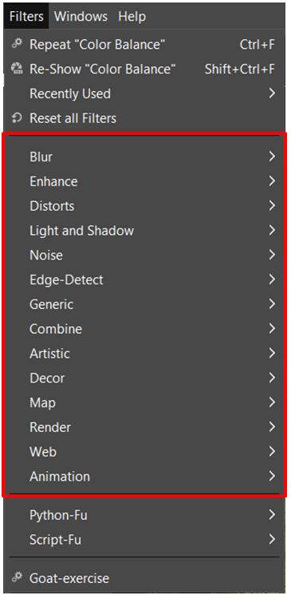

Час. Оптимизација слике за штампање и ради објављивања на интернету
===================================================================

.. infonote::
 
 На овом часу научићеш да:
 
 - обрађујеш растерску слику у изабраном програму;
 - оптимизујеш креирану слику за приказ на различитим медијима;
 - одабереш одговарајући формат записа слика.

Припрема слике за објављивање на интернету се разликује од припреме слике за штампање по резолуцији слике, односно броју тачака по инчу и моделу боје. 
За штампање је потребно да слика буде већег квалитета у CMYK моделу боја, док је за интернет довољна и слика слабијег квалитета у RGB моделу боја.

Поступак којим се дигитална слика подешава за постављање на интернет назива се оптимизација. Крајњи циљ оптимизације је добијање што квалитетније слике са одређеним ограничењем њене димензије (дужине и висине) и величине, тачније количином бајтова које заузима у меморији. Овим у ствари желимо да направимо равнотежу између квалитета и величине датотека. 

Ако желиш да припремиш слику за штампање, потребно је да одабрана резолуција, фотографије буде 300 ppi, а једнобојне илустрације 600 ppi. Поред тога важно је да све боје морају бити приказане у CMYK моделу боја.
Важно је да знаш да када се смањује резолуција слике, повећавају се ширина и висина слике, док ако повећаваш резолуцију слике смањује се ширина и висина слике. То је добро да запамтиш јер се приликом промене резолуције слике мења само број пиксела који ће се приказати по инчу дате слике, а не колико пиксела чини ту слику. 

За промену резолуције слике одабере се Image → Print Sizе. Кликом на дату опцију отвара се прозор у коме је могуће мењати резолуцију слике.

.. figure:: ../../_images/L33S1.png
    :width: 400px
    :align: center
    :class: screenshot-shadow
    
Слике које желиш да поставиш на интернет такође треба да буду врхунског квалитета, слично као и слике које су припремљене за штампање. Већина дигиталних слика које се објављују на интернету су ниске резолуције, углавном 72 dpi. 

Први корак у оптимизацији слике је најчешће опсецање. Опсецањем се одређује садржај фотографије уклањањем њених непотребних делова. 
Након овог корака следе кораци за додатно уређивање слике, а то су најчешће повећање или смањење неких параметара слике попут осветљености, контраста, 
оштрине или додавање специјалних ефеката.

Промена нивоа обојености, осветљености и контраста 
--------------------------------------------------

Ако су слике превише светле или тамне, нису оштре, имају прејаке боје или имају неке друге недостатке, могуће их је модификовати коришћењем алатки из менија Color. 
Над одабраним делом слике или целом сликом можеш да извршиш додатне корекције попут промене нивоа осветљености, контраста или обојености. 
У оквиру менија Colors можеш да подесиш равнотежу боје опцијом Color Balance, промениш контраст или осветљеност опцијом Brightness-Contrast, промениш обојеност опцијом Colorize и извршиш друга подешавања.

Над одабраним делом слике или целом сликом можеш да извршиш додатне корекције попут промене нивоа осветљености или контраста (разлику између најтамнијих и најсветлијих области). Ако желиш да просветлиш, потамниш или да направиш контраст, потребно је да одабереш опцију Brightness-Contrast. Кликом на дату опцију отвара се прозор у коме можеш да мењаш осветљење или контраст.

.. figure:: ../../_images/L33S2.png
    :width: 400px
    :align: center
    :class: screenshot-shadow

Ако је слика превише тамна, потребно је да у одељку Brightness помераш клизач у десну страну или одабереш стрелицу на горе, чиме се повећава вредност осветљења на слици. 
А ако је слика превише светла, потребно је да клизач помераш улево или одабереш стрелицу на доле, чиме се смањује вредност осветљења на слици.

Најчешће је, ради постизања оптималног изгледа слике, потребно комбиновати промену осветљења и контраста. Вредности за контраст се подешавају на исти начин, коришћењем клизача или стрелица.  

Након подешавања жељеног осветљења и контраста, довољно је да кликнеш на дугме ОК, чиме потврђујеш своја подешавања.

Ако желиш да подесиш да дигитална слика буде приказана у нијансама сиве, то можеш да урадиш одабиром опције Color → Desaturate → Color to Gray.

.. figure:: ../../_images/3.1.png
    :width: 780px
    :align: center
    :class: screenshot-shadow

Исту акцију можеш да примениш и коришћењем опције Color → Desaturate → Desaturate.  Кликом на дату опцију отвара се прозор у коме из листе Mode бираш неку од опција.

.. figure:: ../../_images/L33S4.png
    :width: 400px
    :align: center
    :class: screenshot-shadow

Кликом на опцију Color Balance отвара се прозор у коме подешаваш количину тиркизне, љубичасте или жуте боје на слици, уз могућност да додаш и црвене, зелене или плаве боје. 

У оквиру овог прозора можеш да подесиш тамне (Shadows), средње (Midtones) или светле делове (Highlights) слике, те да, померањем клизача, подесиш нивое боја  (Cyan, Magenta, Yellow).

Филтери
-------

Филтери су посебна врста алата која се користи за постизање различитих ефеката на слици попут замућености или изоштравања фотографије или различитих уметничких ефеката.  Филтере можемо да применимо на слој или селекцију. Њима приступамо кроз мени Filters (Филтери).

Филтери су подељени у неколико категорија, од којих су најчешће коришћени:

- Blur (Замућење) – скуп филтера који замућују слој или селекцију. 
- Enhance (Побољшај) – скуп филтера за изоштравање слике, отклањање мрља, црвенила очију… 
- Distorts (Изобличења) – скуп филтера са ефектима мозаика, ветра, таласа,… 
- Artistic (Уметнички) – скуп филтера који стварају уметничке ефекте као што је изглед уља на платну, витража…

Кликом на већину филтера отвара се помоћни мени у којем можеш да видиш како ће изгледати слика након примене филтера, те да измениш додатне параметре за постизање жељеног резултата. Померањем клизача можеш да прегледаш било који део слике. Притиском на тастер OK потврђујеш примену одабраног филтера.

На доњој слици у оквиру 4 правоугане селекцијe примењени су различити филтери: Pixelize (1), Sharpen (2), Watherpixels (3) и Mosaic (4).

Последњи корак је смањивање димензија, односно свођење резолуције на потребну вредност. 

.. |s1| image:: ../../_images/L33S8.png
               :width: 50px

.. |s2| image:: ../../_images/L33S9.png
               :width: 30px

.. |s3| image:: ../../_images/L33S10.png
               :width: 30px

У овом случају, за промену резолуције слике можеш да користиш опцију Image → Scale Image. Кликом на дату опцију отвара се прозор у коме је могуће да подесиш димензију слике која може да буде изражена на различите начине (бројем пиксела, у центиметрима, милиметрима, итд.). 
Димензију слике по ширини (Width) и по висини (Height) мењаш или уношењем у текстуално поље жељених вредности или коришћењем стрелица на горе (за повећање вредности) или на доле (за смањење вредности). 
Мерну јединицу којом ће бити приказана димензија слике мењаш коришћењем падајуће листе  |s1|. 
У случају да је опција |s2| укључена (изглед закључаног катанца) задржава се пропорција, тачније однос између ширине и висине дигиталне слике. 
Приликом промене једне димензије слике аутоматски ће се мењати друга димензија, задржавајући пропорцију димензија слике. У случају да је катанац откључан (раскинут) |s3|, промена једне димензије слике не утиче на промену друге димензије.

Веома је важно да се јединица мере подеси на број тачака (пиксела) јер се она користи за димензије слика на интернету, и да се слика резолуције подеси на 72 dpi. 

Ако желиш да видиш реалну величину фотографије из главног менија, изабери опцију Vew, Actual pixel size (Alt+Ctrl+0). 

И на крају, одабиром опције Cubic из падајуће листе Interpolation, oбезбеђујеш да алгоритам програма одреди јасноћу слике, односно да програм мора да креира нове информације о пикселима да би се извршила модификација слике. Опцијом Cubic рачуна се боја сваког пиксела као просечна боја осам најближих пиксела на оригиналној слици. То обично даје најбољи резултат, али природно захтева више времена. Тачније, ако слика има димензију 1250 x 980 тачака, а треба да се смањи на 550 тачака по дужој страни, програм треба да израчуна како да, информације забележене на 1250 тачака сведе на 550 тачака и да пружи резултат који је најближи оригиналу. 

Коначно, оптимизацију слике завршаваш избором одговарајућег формата датотеке и подешавањем параметара компресије. Важно је да знаш да су подржани формати слика које ћеш поставити на интернету су: jpg, gif и png. 

.. infonote::

 **Укратко**
    •	Оптимизација је поступак којим дигиталну слику подешаваш за постављање на интернет или је припремаш за штампање. 
    •	Већина дигиталних слика које се објављују на интернету су ниске резолуције, углавном 72 dpi.
    •	Ако желиш да припремиш слику за штампање, потребно је да одабрана резолуција, фотографије буде 300 ppi, а једнобојне илустрације 600 ppi.
    •	Опсецање је први корак у оптимизацији фотографије.
    •	Други корак је додатно уређивање осветљености, контраста или оштрине слике након одсецања, тако да изгледа онако како нама одговара. 
    •	Трећи корак је смањивање димензија, односно свођење резолуције на потребну вредност.
    •	Коначно, оптимизацију слике завршавамо избором одговарајућег формата датотеке и подешавањем параметара компресије. 
    •	Подржани формати слика које се постављају на интернету су jpg, gif и png. 