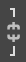

Квиз. Оптимизација слике за штампање и ради објављивања на интернету
====================================================================

Питање 1.
~~~~~~~~~

.. fillintheblank:: L33P1

    Нека је дата слика димензије 2736x3648, резолуције 96ppi. Када се слика отвори у програму Gimp 2 и смањи на 700 пиксела по ширини, колика ће бити димензија слике по висини, ако је одабрана опција |а1|? 

    Одговор: |blank|

    - :^933$: Тачно
      :x: Одговор није тачан.

.. fillintheblank:: L33P2

    Нека је дата слика димензије 2736x3648, резолуције 96ppi. Када се слика отвори у програму Gimp 2 и смањи на 700 пиксела по ширини, колика ће бити димензија слике по висини, ако је одабрана опција |а2|? 

    Одговор: |blank|

    - :^3648$: Тачно
      :x: Одговор није тачан.

Питање 2.
~~~~~~~~~

.. fillintheblank:: L33P3

    Како се назива поступак којим дигиталну слику припремаш за штампање или за објављивање на интернету? Унеси одговор малим словима ћириличким писмом.

    Одговор: |blank|

    - :^оптимизација$: Тачно
      :x: Одговор није тачан.

Питање 3.
~~~~~~~~~

.. fillintheblank:: L33P4

    Која је најчешћа резолуција (ppi) слика које се објављују на интернету? 

    Одговор: |blank|

    - :^72$: Тачно
      :x: Одговор није тачан.

Питање 4.
~~~~~~~~~

.. fillintheblank:: L33P5

    Која је најчешћа резолуција (ppi) слика које су припремљене за штампу? 

    Одговор: |blank|

    - :^300$: Тачно
      :x: Одговор није тачан.