Час. Обрада растерске слике
===========================

.. infonote::
 
 На овом часу научићеш:
 
 - да обрађујеш растерску слику у изабраном програму.

Познато ти је да дигиталну слику можеш додатно да уређујеш тако што ћеш на слици мењати
ниво осветљености, контраст, обојеност, применити филтере да би се слика изоштрила,
замутила или додали специјални ефекти.
На овом часу ћеш научити како да примениш одређене геометријске трансформације над
сликом.

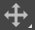

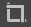

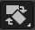

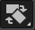

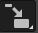

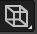

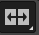
			   			   

Основне геометријске трансформације слике
------------------------------------------

Поред алатки као што су алатке за померање |b1| и одсецање |b2|, у програму Gimp 2 постоји више алатки којима можеш да извршиш различите трансформације на слици. Овим алаткама приступаш десним кликом на алатку |b3| или коришћењем опције Tools →  Transform Tools.

Селектовани део слике можеш да:

.. csv-table:: 
   :header: "акција", "иконица",
   :widths: auto
   :align: left
   
   "ротираш", "|b4|",
   "промениш му величину", "|b5|"
   "искосиш", "|b6|"
   "промениш му перспективу," "|b7|"
   "клонираш", "|b50|"
   "преокренеш", "|b8|"

Ротација
--------- 

Ротирање селектованог дела слике вршиш тако што одабереш алатку за ротацију или  Tools → Transform Tools → Rotate. Кликом на дату опцију отвара се прозор у коме подешаваш угао (Angle) ротације тако што помераш клизач или уносиш бројну вредност. Такође, у овом прозору се дефинише и где ће се налазити центар ротације. На крају, потврђујеш избор кликом на дугме Rotate. 

.. figure:: ../../_images/L35S9.png
    :width: 300px
    :align: center
    :class: screenshot-shadow

Промена величине 
-----------------  

Промену величине селектованог дела слике вршиш тако што одабереш алатку за промену величине или  Tools → Transform Tools → Scale. 
Кликом на дату опцију испод палете алатки отвара се део простора у коме можеш да извршиш промену димензије слике по ширини (Width) или по висини (Height). 
Уколико је катанац са десне стране закључан, димензије слике ће се мењати пропорционално, односно са променом једне димензије мењаће се сразмерно и друга како би се задржале пропорције слике. 
Уколико је катанац откључан, промена једне димензије слике неће утицати на другу димензију слике.

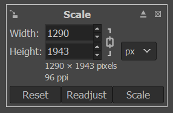

Искошавање
----------
	
Искошавање селектованог дела слике вршиш тако што одабереш алатку за искошавање или  Tools → Transform Tools → Shear. Кликом на дату опцију отвара се прозор у коме подешаваш угао искошавања тако што помераш клизач или уносиш бројну вредност. На крају, потврђујеш избор кликом на дугме Shear.  

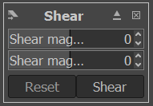

Опција се примењује кликом на део слике.

Преокретање
------------  

Преокретање селектованог дела слике вршиш тако што одабереш алатку за преокретање или  Tools → Transform Tools → Flip. Кликом на дату опцију испод палете алатки отвара се део простора у коме можеш да извршиш хоризонтално или вертикално преокретање слике, кликом на селектовани део слике.

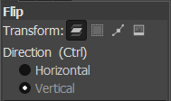

Клонирање
---------

Клонирање дела слике вршиш тако што одабереш алатку за клонирање или Clone. Кликом на дату опцију врши се клонирање тако што се одабере део слике који се клонира у облику селектоване четке 
(Brush) притиском тастера Alt и кликом на део слике који се клонира, а затим постављањем миша на површину на коју желиш да клонираш селектовани део слике.

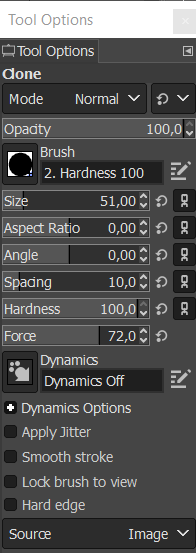

Додавање текста на дигиталну слику
-----------------------------------

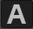

На било коју дигиталну слику у програму Gimp 2  можеш да додаш жељени текст.

За додавање текста потребно је да отвориш слику на коју желиш да додаш текст или креираш нову слику на којој ће бити текст, а затим, одабереш опцију |b9| или Tools → Text и кликнеш примарним тастером миша на место на слици где желиш да поставиш текст. 

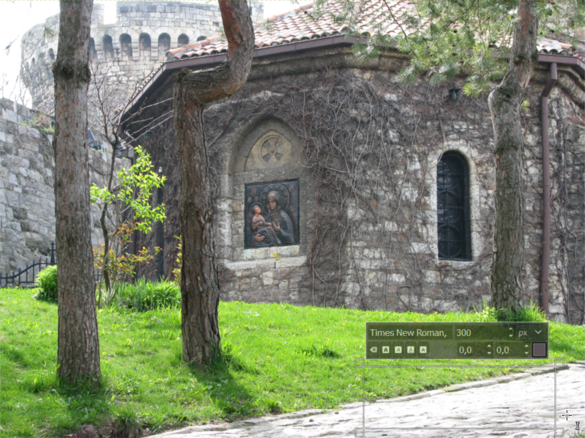

Одабиром ове опције отвара се део простора у коме можеш да мењаш врсту фонта и величину фонта, подешаваш поравнавања текста, или да одабереш промене боје фонта. 

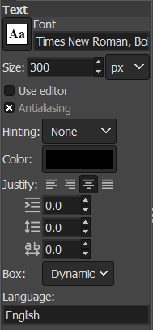

Одабиром опције Use Editor отвара се прозор у коме можеш да унесеш жељени текст.

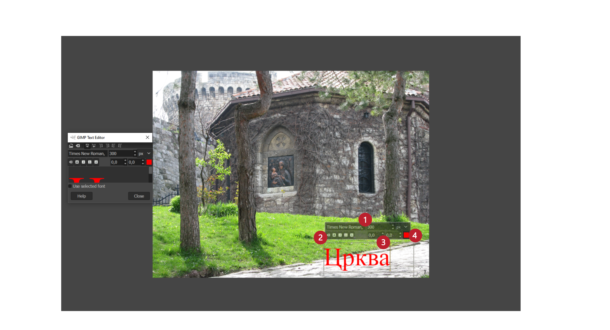

Осим наведених опција, када почнеш да уносиш текст, на слици ће се појавити прозор у коме је могуће на бржи начин променити фонт и величину фонта (1) и стил фонта (2). Поред тога могуће је променити проред, размак између слова (3), као и боју текста (4).

Текст можеш да упишеш и накнадно мењаш, само га претходно мораш означити. За поништавање оквира за унос текста можеш да притиснеш тастер [Esc] или да одабереш неки други алат у Toolbox.
Можеш да креираш текст на прозирној позадини који можеш да користиш на интернету или да га поставиш преко неке слике. 
Код таквог текста ће се само видети слова, без икакве позадине, док ће се иза слова видети страница или слика на коју је постављен текст. Важно је да знаш да не подржавају сви формати слике прозирност, тако да прозирност слике најчешће чуваш у .png или .gif формату.

За израду прозирног текста прво је потребно да отвориш нову слику одабиром опције File → New. У датом прозору у делу Advanced Options из падајуће листе Fill with потребно је да одабереш опцију Transparency. Након одабира димензије слике, потврди избор кликом на дугме ОК. 

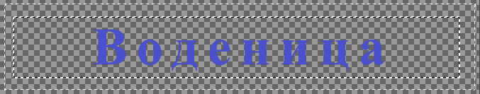

Када унесеш текст, остатак слике можеш одсећи. На крају слику треба извести у неком од формата који одржава провидност.

Горњи текст је постављен на слици која се састоји из три различита обојена правоугаоника. Без обзира на боју позадине, текст остаје прозиран.

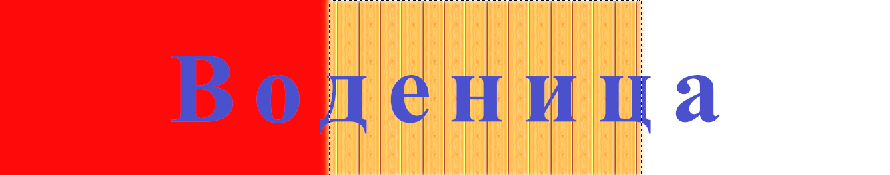

Слојеви
--------

Један од најлакших начина за уређивање слике је коришћење слојева (Layers). Слојеви су делови слике који се користе при обради дигиталних слика за одвајање њених елемената. 
Могу се тумачити тако да је једна слика исцртана од више појединачних слика на провидним фолијама које су поређане једна на другу. Када поставиш све те цртеже један на други, видећеш све цртеже одједном, тачније видећеш целу слику. 

На примеру доње слике можеш да видиш да се слика састоји од четири засебне слике.

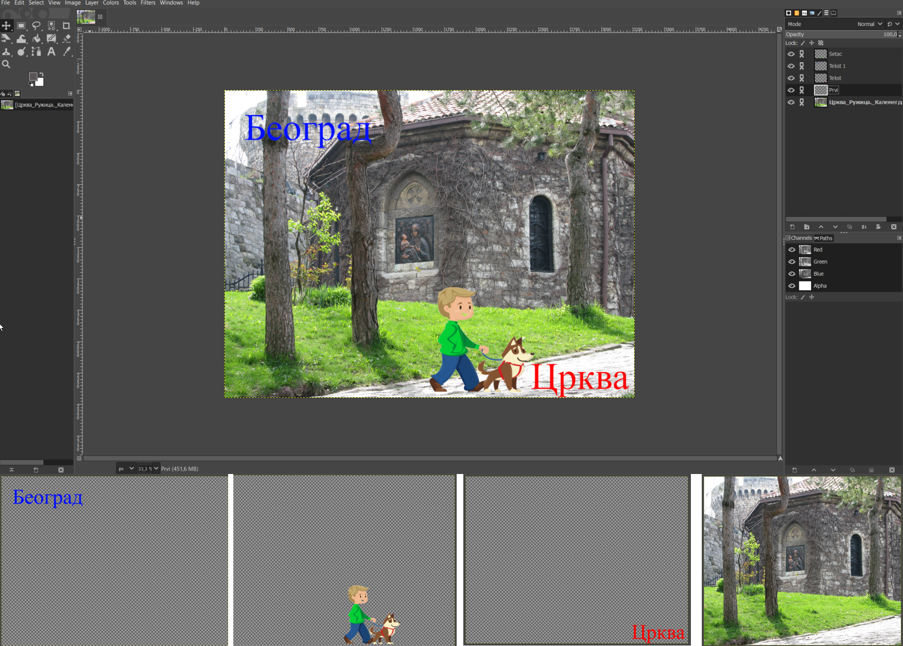

Додавање и брисање слојева
---------------------------

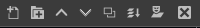

Постоји више начина да креираш нови слој, и то да:

-  одабереш опцију Layer →  New Layer,
-  притиснеш комбинацију тастера Shift + Ctrl + N,
-  кликнеш на прво дугме у дну палете Layers |b10|.

Одабиром дате опције отвара се прозор у коме можеш да именујеш слој, подесиш његову резолуцију и означиш да ли ће бити провидан или испуњен бојом. Притиском на дугме OK додајеш слој у палету слојева.

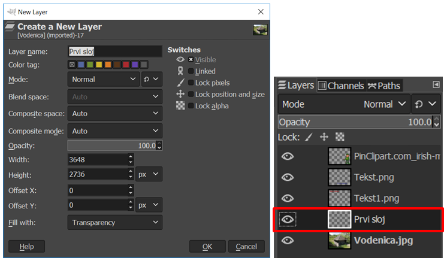

На дну палете слојева, поред дугмета за додавање новог слоја, 

налазе се редом: 

-  дугме за креирање нове групе слојева, 
-  дугме за померање активног слоја на једно место више у палети, 
-  дугме за померање активног слоја за једно место ниже у палети, 
-  дугме за креирање дупликата слоја, 
-  дугме за спајање слојева,
-  дугме за усидравање и 
-  дугме за брисање слоја.

Поред опција за креирање нових слојева, копирања или брисања постојећих, у картици Layers слојеве можеш да учиниш видљивим или скривеним, повезаним или неповезаним, али да мењаш начин мешања (1), провидност (2) или да их закључаш (3). 

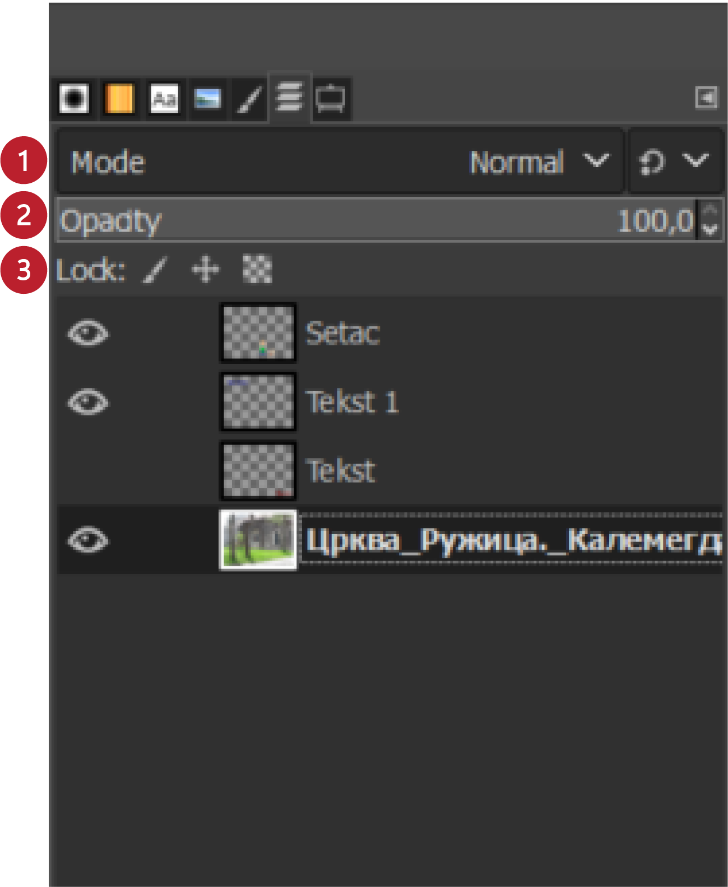

Уколико картица Layers није приказана приликом покретања програма Gimp 2, можемо је приказати комбинацијом тастера Ctrl + L.  

Ако желиш да вршиш неке измене на неком слоју, тај слој мора да буде активан. Слој чиниш активним тако што кликнеш на његов назив у палети слојева. Кликом на дугме за брисање слоја (иконица кантице) можеш да избришеш само активан слој. Важно је да знаш да све измене вршиш само на активном слоју. 

Двоструким кликом на назив слоја можеш да промениш његов назив тако што унесеш ново име, а затим притиснеш тастер Enter. 

Приказивање и сакривање слоја 
-----------------------------

Доња слика је састављена од четири слоја, чија имена и редослед можеш да видиш у палети слојева. Испред слојева видљиве су две иконице (око и ланац). 
Ако је иконица ока приказана, слој је видљив (приказан) у прозору за приказ слике, а ако није приказана, слој није видљив.

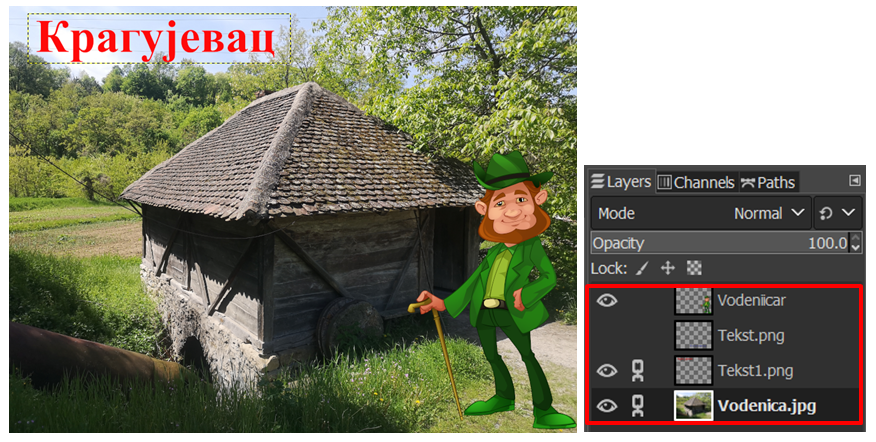

.. |b11| image:: ../../_images/L35S23.png
          :width: 50px

Иконица ланца означава везу између два или више слојева. Када је видљива, слојеви су повезани и можеш да их заједно помераш употребом алата Move |b11|. 

Подешавање непровидности, закључавање и стапање слојева
-------------------------------------------------------

Непровидност (енгл. Opacity) подешаваш за сваки слој засебно. Вредност се креће од 0 (провидно) до 100 (непровидно). Иницијално, сваки слој је непровидан (Opacity је подешена на 100%). Вредност за провидност/непровидност можеш да мењаш тако што упишеш жељену вредност, или користиш клизач, или користиш стрелице на горе и на доле.

Закључавањем слоја спречаваш измену његовог садржаја. Опција Lock штити слојеве од измена на два начина:

-  кликом на иконицу четкице закључаваш све пикселе на слоју;
-  кликом на иконицу провидног слоја закључаваш само провидне пикселе на слоју.

Стапање (мешање) слојева одређује начин на који ће се пиксели који се налазе на доњем слоју преклопити (измешати) са пикселима који се налазе на горњем слоју. Почетно подешавање је Normal, чиме је обезбеђено да горњи слој у потпуности прекрива доњи (ако је непровидност подешена на 100%). 

У програму GIMP 2 постоји 21 начин мешања слојева који се приказују кликом на стрелицу поред опције Mode (Начин мешања). Неки од ових начина мешања слојева можеш да користиш за потамњивање слике (Multiply, Overlay), неке при раду са црно-белим фотографијама (Dodge), а неке за отклањање ефекта црвених очију (Hue) који се понекад јавља приликом фотографисања дигиталним уређајима.
У случају да део слике или целу слику желиш да копираш у неку другу слику, тај део ће се одмах поставити као нови „плутајући“ слој (Floating Selection (Pasted Layer)), па није потребно да правиш потпуно нов слој за тај део.

.. figure:: ../../_images/L35S24_1.png
    :width: 400px
    :align: center
    :class: screenshot-shadow
    
Сада је потребно само да кликнеш десним кликом миша на тај „плутајући“ слој и одабереш опцију To New Layer. Тако ће се копирани део слике или слика аутоматски поставити у нов слој.

Растеризација слоја
---------------------

У појединим програмима за обраду растерске графике текст је векторски слој у растерској слици. То је случај и код програма Gimp 2. 
Повећањем величине слова не долази до губитка квалитета слике.

Векторски слој са текстом можеш да трансформишеш у растерски. Када кликнеш десним тастером миша на текстуални слој, појавиће се помоћни мени у коме треба да одабереш  опцију Discard Text Information. Овом опцијом ће се векторски текстуални слој претворити у растерски. Овај процес називамо растеризaција. Ако бисмо сада повећали слова, дошло би до губитка квалитета слике.

.. infonote::

 **Укратко**
    •	Дигиталну слику додатно уређујеш тако што: вршиш корекцију слике (ниво осветљености, контраста, обојености, итд.), примењујеш филтере да изоштриш, замутиш слику или додаш специјалне ефекте, примењујеш геометријске трансформације над сликом.
    •	Растеризација је поступак претварања векторске слике у растерску.