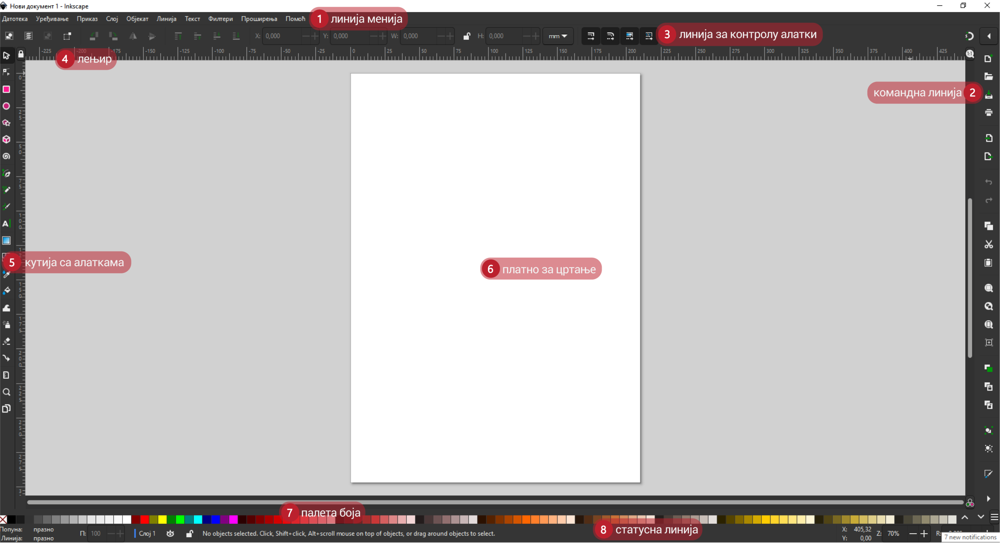
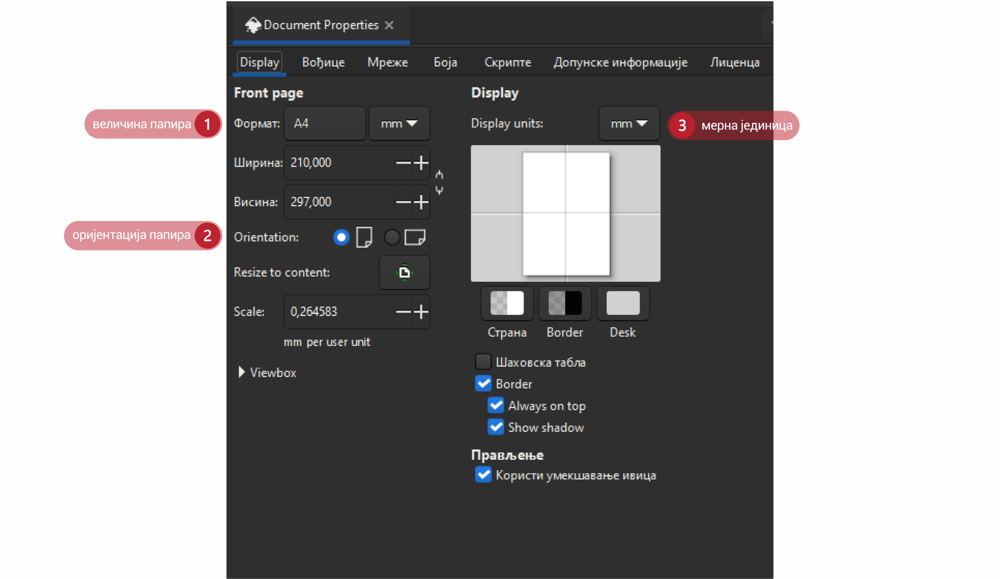
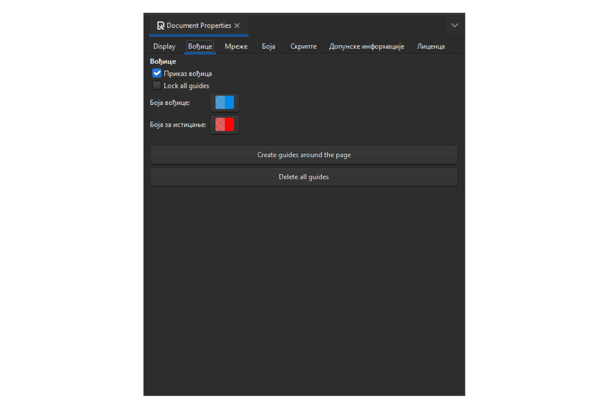
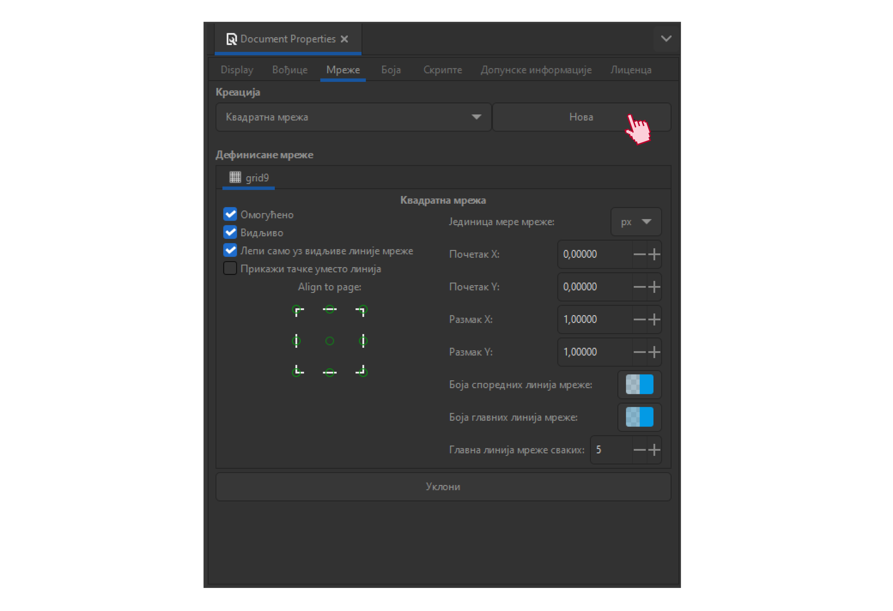

Час. Радно окружење програма за креирање векторске графике
==========================================================

.. infonote::
 
 На овом часу научићеш да:
    •	 креираш векторске слике у одабраном програму;
    •	 урадиш припрему за цртање векторске графике;
    •	 црташ векторске објекте.

Хајде да се подсетимо!

Питање: 
~~~~~~~

На следећој слици су бројевима од 1 до 8 означени типови графике (растерска и векторска графика).

.. fillintheblank:: L37P1_1

    Пажљиво погледај слику и означи само растерску графику. Унеси одговор као растући низ бројева, нпр. 123457. 

    Одговор: |blank|

    - :^1357$: Тачно
      :x: Одговор није тачан.
    
Векторска графика је дефинисана једначинама које одређују линије, облике и положаје. Kод векторске графике слика се састоји од објеката.  Објекти могу бити линије, кругови, квадрати, троуглови, спирале или други облици.
Векторске слике су обично конструисане од линија.Ове линије које чине облике описане су математичким функцијама и програм их тако памти. Због тога се векторска графика може 
повећавати и смањивати без икаквих губитака квалитета јер се постојећи облици увек изнова исцртавају по истој функцији али са различитим параметрима. Зато без обзира на то колико 
великом учините своју слику, увек изгледа савршено. Често графика изгледа и боље када је увећана зато што су кривуље глађе. 

Током ових часова бавићеш се креирањем векторске графике.

Векторску графику можеш да креираш и обрађујеш у бројним програмима. Неки од њих су  Inkscape, Corel Draw и Adobe Illustrator. У овом разреду, упознаћеш се са основним техникама за креирање и обраду дигиталних слика у програму Inkscape. 

Програм можеш да преузмеш са интернет странице https://inkscape.org/en/download. 

Поступак инсталације програма можеш погледати на доњем видеу:

.. ytpopup:: 8lEIXFeHiRM
    :width: 735
    :height: 415
    :align: center 

Основна подешавања 
-------------------

Пре него што започнеш рад у програму за обраду и креирање векторске слике, добро би било да извршиш нека једноставна подешавања програма. За то, можеш да користиш опцију Preferences из менија Edit. Oдабиром ове опције отвара се прозор у коме можеш да подесиш изглед радног окружења, жељени језик на ком ћеш радити, величину икона, максималан број сачуваних докумената приказаних у опцији Open Recent, величину корака за померање објеката и многе друге опције.

Отварање новог документа
------------------------- 

По правилу, креирање векторске слике започиње цртањем на празном документу, иако је могуће цртати и на неком постојећем документу. 
Празну страну користиш када желиш да црташ, бојиш, формираш различите објекте и слично. Креирање нове векторске слике врши се тако што одабереш опцију New из менија File. 
Одабиром ове опције отвара се прозор као на слици.
Покретањем програма Inkscape отвара се нови документ формата SVG (Scalable Vector Graphics). Радно окружење програма Inkscape приказано је на доњој слици.

    
Централно место радног окружења чини страница на коју можеш да поставиш различите објекте. Кликом на мени File и одабиром опције Document Properties отвориће се прозор са више 
картица. У оквиру картице Page можеш да промениш величину (Page Size) и оријентацију (Portrait, Landscape) странице, као и јединицу мере (Units).  

У одељку Page Size  можеш да одабереш величину странице одабиром неке од понуђених величина (одређених стандардних формата као што су А0, А1, А3, А4, итд.). 
У одељку Custom Size можеш да дефинишеш ширину (Width) и висину (Height) новоформиране слике, која може бити приказана у пикселима, инчима, центиметрима итд. 
(мерну јединицу мењаш из падајуће листе). Ако величину уписујеш ручно, потребно је посебно да упишеш ширину и посебно висину, или можеш за уношење вредности да 
користиш стрелице за горе и доле.
У одељку Orientation на брз начин можеш да промениш оријентацију, односно усмерење документа, и то усправно (Portrait) или положено (Landscape).
Осим величине документа и оријентације, у падајућој листи Units можеш да одабереш  мерну јединицу коју желиш да користиш, а која зависи од намене цртежа на коме радиш. 
Можеш да одабереш пикселе ако креираш графику (банер или лого) за неку интернет страницу, или инче, милиметре, центиметре, метре, односно неке друге од понуђених јединица.

У оквиру картице Guides могуће је активирати приказ помоћних линија (вођица) на страници.  Ове линије можеш да користиш за прецизно постављање објеката на страницу. Помоћне линије постављаш тако што кликнеш на лењир (хоризонтални или вертикални) и, држећи притиснут примарни тастер миша, повлачиш линију под жељеним углом. Двоструким кликом на линију отвара се помоћни мени Guideline у оквиру кога подешаваш назив маргине (Label), боју, позицију или угао линије. 

Означену помоћну линију можеш да обришеш тако што притиснеш тастер [Delete].

Ако је за прецизно постављање потребно више помоћних линија, можеш да учиниш видљивом мрежу помоћних линија. У оквиру картице Grid бираш да ли да мрежа буде правоугаона (Rectangular) или аксонометријска (Axonometric). У истој картици дефинишеш јединицу мере за помоћне линије (Grid units), постављаш почетну координату (Origin X, Origin Y),  као и размак између линија (Spacing X, Spacing Y).

Чување и извоз слике
---------------------

Слику можеш да чуваш и коришћењем опције File → Save или File → Save Аs. Слика је тада сачувана у формату .svg који можеш да отвориш само у Inkscapeу.
Важно је да знаш да слику сачувану у .svg формату можеш да отвориш на другом дигиталном уређају само ако и на том другом уређају имаш инсталиран програм Inkscape. 

Ако желиш да слику отвориш на неком другом дигиталном уређају, слику мораш да сачуваш у PNG формату. За то је потребно да користиш опцију File → Export PNG Image → Export. 

Одабиром ове опције отвара се прозор у коме бираш како желиш да извезеш дату слику. Одабиром једне од картица Page, Drawing, Selection и Custom бираш да ли желиш да извезеш целу страну, само цртеж, само означени део слике или  нешто произвољно. 

.. figure:: ../../_images/7_6.png
    :width: 780px
    :align: center

Поред тога можеш да бираш и величину и резолуцију слике коју извозиш. Кликом на дугме Export As отвара се прозор у коме бираш локацију, тачније фасциклу у којој чуваш слику и уносиш име слике које желиш да сачуваш, и на крају кликом на дугме  Export извозиш дату слику у PNG формату.

Отварање постојеће слике
------------------------

Слику преузету са интернета, скенирану или направљену дигиталним уређајем, отвараш у програму за обраду растерске графике одабиром опције File → Open. 
Одабиром ове опције отвара се прозор из кога бираш место, тачније фасциклу у којој је сачувана слика. Кликом на дугме Open отвориће се слика на којој можеш да примениш 
неколико различитих техника за уређивање исте.

Често ће се дешавати да мораш да отвориш већ сачувану слику у .svg формату ради неких измена или копирања неких делова слике у други документ. Постојећи документ отвараш одабиром опције File → Open, или комбинацијом тастера Ctrl + O. 
Одабиром било које од ових опција отвара се прозор из кога бираш место, тачније фасциклу у којој се налази сачувана слика. Кликом на дугме Open отвориће се слика на 
којој можеш да примениш неколико различитих техника за уређивање исте.
Поред опције File → Open, за отварање постојећег документа можeш користити и опцију File → Import. На овај начин је могуће уметнути неку слику у тренутно активни документ, 
тј. документ у коме тренутно радиш. Одабиром ове опције отвара се прозор из кога бираш место, тачније фасциклу у којој се налази сачувана слика. 
Кликом на дугме Open отвориће се прозор у коме можеш да подесиш како ће та слика бити уметнута и кликом на дугме ОК слика је уметнута на страницу.

.. infonote::

 **Укратко:**
 
 - Векторска графика представља начин приказивања слике помоћу објеката (геометријских облика).
 - Векторска графика може се неограничено увећавати без губитка квалитета. 
 - Најчешће коришћени типови (формати) векторских датотека су: SVG, PDF, CDR и DWG.