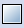
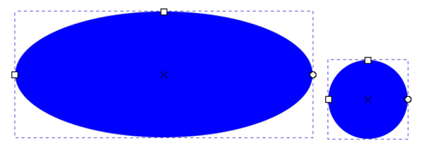
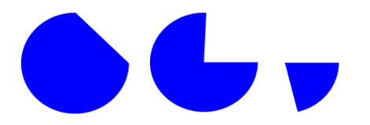

Час. Цртање основних графичких елемената
=========================================

.. infonote::
 
 На овом часу научићеш да:
    •	 креираш векторске сликe у одабраном програму;
    •	 користиш алате за цртање основних графичких елемената;
    •	 користиш алате за креирање текста.

.. |q3| image:: ../../_images/L38S5.png
          :width: 30px

.. |q5| image:: ../../_images/L38S8.png
          :width: 150px          

Програм Inkscape омогућава једноставно креирање основних геометријских облика избором одговарајуће алатке из кутије са алаткама. |q1|

Цртање правоугаоних и овалних облика
-------------------------------------

Правоугаоник и квадрат исцртаваш помоћу алатке |q2|. Правоугаоник исцртаваш тако што кликнеш на страницу и, држећи притиснут примарни тастер миша, помераш позицију миша. Када дођеш до жељене величине, потребно је да отпустиш тастер миша. 

Када је објекат исцртан, на њему можеш уочити квадратиће на угловима (горњем десном и доњем левом) које можеш да користиш за промену величине нацртаног објекта, и кружић (у горњем десном углу) који можеш да користиш за подешавање заобљености ивица датог објекта. 

Квадрат исцртаваш на исти начин као и правоугаоник, уз држање притиснутог тастера Ctrl.
   

Приликом одабира опције за цртање правоугаоника или квадрата отвориће се палета са алаткама у којој подешаваш ширину (1) и висину правоугаоника (2) уношењем вредности или коришћењем дугмића |q4| за промену вредности ових димензија. Ако желиш да промениш радијус објекта, тачније креираш заобљене углове, то радиш тако што унесеш жељене бројне вредности у поља Rx или Ry. Промену мерних јединица мењаш из падајуће листе (4).

Овални облик (елипсу) исцртаваш помоћу алатке |q3|. Елипсу исцртаваш тако што кликнеш на страницу и држећи притиснут примарни тастер миша помераш миш све док не добијеш жељену величину објекта, а затим отпустиш тастер миша. 
Круг исцртаваш на исти начин као и елипсу, уз држање притиснутог тастера Ctrl.

Приликом одабира опције за цртање елипсе или круга отвориће се палета са алаткама у којој подешаваш вредности пречника по хоризонтали Rx или вертикали Ry (1) уношењем жељене вредности или коришћењем дугмета |q4|. Осим тога имаш и могућност да од круга креираш кружне исечке (2) и лукове (3).

Од нацртаног круга можеш да креираш кружне исечке или лукове. За цртање лука користиш бели круг чијим превлачењем добијаш жељени облик или одабереш одговарајућу алатку за исцртавање кружног исечка, лука или се објекат враћа у почетно стање |q5|.

Цртање правилних многоуглова, звезди и спирала 

.. |q8| image:: ../../_images/L38S14.png
          :width: 30px 

.. |q9| image:: ../../_images/L38S17.png
          :width: 30px 

Правилни многоугао исцртаваш тако што одабереш алатку |q6|. Када одабереш ову алатку, отвара се линија са алаткама у којој одабереш алатку |q7| (1). 
Затим, можеш да унесеш број углова правилног многоугла или за то користиш |q4| (2) и вредност заобљавања угла (3).

Правилан многоугао исцртаваш тако што кликнеш на страницу и, држећи притиснут примарни тастер миша, повлачиш миш све док не добијеш жељену величину објекта, а затим отпустиш тастер миша.  
Звезду исцртаваш на сличан начин - одабереш алатку  |q8| (1). Затим, можеш да унесеш број углова, тачније кракова, или за то користиш |q4| (2), вредност однос радијуса од најдубље тачке и радијуса најудаљеније тачке звезде (3), као и вредност заобљавања угла (4).

.. image:: ../../_images/8_4.png
    :width: 900px
    :align: center

.. image:: ../../_images/L38S16.png
    :width: 500px
    :align: center

Спирале исцртаваш тако што одабереш алатку |q9| и, држећи притиснут примарни тастер миша, развлачиш спиралу до жељене величине, и затим отпустиш тастер миша. Одабиром дате алатке појављују се алатке помоћу којих дефинишеш број окрета спирале (Turns).

Промена боје објекта
---------------------

.. |q10| image:: ../../_images/L38S19.png
          :width: 30px 

Објекти у програму Inkscape су дефинисани унутрашњом облашћу (Fill) и ивицом (Stroke). Овим карактеристикама можеш независно да мењаш боју. 

Промену боје унутрашње области или ивице селектованог објекта или групе селектованих објеката вршиш избором жељене боје из палете боја. 
Промену боје унутрашње области објекта можеш да вршиш тако што одабереш опцију |q10|. 

Поред тога боју можеш да мењаш и тако што кликнеш на боју поред назива Fill: и Stroke:.

Одабиром неке од ових опција отвара се прозор Fill and Stroke, у коме вршиш детаљна подешавања изгледа унутрашње области и ивице објекта. 

Помоћни мени Fill and Stroke можеш да покренеш и из менија Object → Fill and Stroke. У оквиру овог прозора можеш да изабереш једну од картица Fill, Stroke paint и Stroke style. У картици Fill подешаваш боју унутрашњости објекта. На овој картици можеш да одабереш једну од шест опција које се односе на врсту приказа боје унутар објекта, и то, респективно:

	
|

.. csv-table::
   :widths: 20, 80	
   :align: left
   
    "X", "означава да унутар објекта нема боје, тачније објекат је без боје"
	"Flat color", "означава коришћење било које појединачне боје на елементу"
	"Linear gradient", "приказује се линеарни прелаз боја између минимално две боје"
	"Mash gradient", "приказује се кружни (радијални) прелаз боја између минимално две боје"
	"Pattern", "означава да објекат може да буде обојен по неком узорку"
	"Swatch", "аутоматски се чувају последње одабране боје"

| 

Следеће што можеш одабрати је модел боје уношењем бројева за сваку компоненту боје, или једноставним кликом на сваку компоненту боје. 
Наравно, могуће је подесити и вредности замућења (Blur) или провидности (Opacity) унутрашње области објекта. Предефинисана вредност за замућење је 0, а за провидност 100%. 
Вредности можеш мењати уношењем жељене вредности, коришћењем клизача или коришћењем дугмића |q4|.

У картици Stroke paint можеш да одабереш боју линије, бирајући најпре једну од опција које су идентичне као у картици Fill, а затим и одабиром жељеног модела боје. 

У картици Stroke style можеш да одабереш дебљину ивице, врсту ивице (цртице, тачкице, итд.), различите врсте завршетка ивица  као и маркере на крају линије (стрелице, круг, квадрат, итд.). 

Цртање линија 
--------------

.. |q11| image:: ../../_images/L38S25.png
          :width: 30px 

.. |q12| image:: ../../_images/L38S26.png
          :width: 30px 

За цртање правих и неправилних линија можеш да користиш алатку |q11|. За цртање праве линије потребно је да кликнеш примарним тастером миша на страницу, затим преместиш курсор миша на место где желиш да буде крај дужи и поново кликнеш на страницу. За цртање неправилних линија потребно је да кликнеш примарним тастером миша на страницу и, држећи га пртитиснутим, црташ линију жељеног облика. Цртање завршаваш отпуштањем тастера.

За цртање изломљених линија користиш алатку |q12|. За цртање изломљене линије кликнеш примарним тастером миша на страницу, затим преместиш курсор миша на место где желиш да изломиш линију, поново кликнеш и преместиш курсор миша. Понављаш ову радњу све до крајње тачке изломљене линије, коју означаваш двокликом на страницу.

Уметност лепог писања
---------------------

.. |q13| image:: ../../_images/L38S27.png
          :width: 30px 

.. |q14| image:: ../../_images/L38S29.png
          :width: 30px 

У програму Inkscape је могуће вршити писање лепим украсним словима, користећи технику калиграфије. 
Ако одабереш алатку |q13| отварају се алатке у којима је могуће да одабереш да ли ћеш за писање да користиш маркер, четкицу или налив перо (1), затим да одабереш врсте линија - дебље или тање (2), као и угао (3) и правац писања (4). 

Ако користиш програм Inkscape на таблету, можеш да подесиш и осетљивост на притисак одабиром опција |q14|.

Креирање текста
---------------

У програму за креирање векторске графике можеш да уносиш тест, креирајући наслове, банере, логое или натписе. 

.. |q15| image:: ../../_images/L38S30.png
          :width: 30px 

За креирање текста потребно је да изабереш алатку |q15| и кликнеш на страницу, и затим започињеш уношење текста. 
Одабиром ове алатке отвара се низа алатки у којима можеш да подесиш врсту и величину слова, измениш хоризонтално и вертикално растојање између речи или слова, 
поставиш поравнање, креираш текст у експоненту или индексу, као и да ротираш слова. 

.. image:: ../../_images/L38S31.png
    :width: 900px
    :align: center 

Ако желимо да вршимо измене на већ унетом тексту, потребно је да га најпре селектујеш, а затим примењујеш жељене измене.

.. infonote::

 **Укратко**
    •	Векторску графику можеш да креираш и обрађујеш у програму Inkscape.
    •	Основне елементе (тачке, линије, криве, кругове, многоуглове...) који граде векторску слику називамо објектима.
    •	Програм Inkscape омогућава једноставно креирање основних геометријских објеката избором одговарајуће алатке из Toolbox (Кутија са алаткама).
    •	У програму Inkscape можеш да креираш велике и комплексне текстове, али и наслове, банере, логое или натписе.
