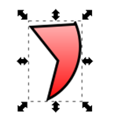

Час. Операције над објектима
============================

.. infonote::
 
 На овом часу научићеш о:
 
 - oперацијама над објектима;
 - векторизацији растерске слике.

.. |d1| image:: ../../_images/L39S1.png
          :width: 30px

Основна алатка у програму Inkscape jе алатка за селекцију |d1|. Користи се за манипулацију објектима (померање, промена величине, ротација, итд.). Ако желиш да вршиш неке измене на објекту, мораш најпре да га селектујеш.

Померање објеката
------------------

Када означиш објекат коришћењем алатке за селекцију |d1|, око објекта се формира оквир са 8 двостраних стрелица. 

Као што смо већ више пута поновили, објекат можеш да помераш само када је селектован (уоквирен), и то превлачењем мишем или употребом стрелица на тастатури. Притиском на стрелице са тастатуре објекат се помера у жељеном смеру за 2 пиксела. Када су у исто време притиснути тастер Shift и стрелице са тастатуре, померање је 10 пута веће (20 пиксела).

.. suggestionnote::
    
    Oво померање можеш да подесиш у опцији Preferences из менија Edit. У том прозору, у одељку Behavior, одабереш опцију Steps, у којој подешаваш број пиксела за које се врши померање објеката. 

Редослед објеката
-----------------

Објекти које постављамо на страницу нису у истој равни, већ су поређани по нивоима. Сваки нови објекат налази се на нивоу изнад претходног.

Редослед означеног објекта можеш да промениш применом алатки:

Raise помера означени објекат на горе за један ниво;
Lower помера означени објекат на доле за један ниво;
Raise to Top помера означени објекат на врх, на први ниво;
Lower to Bottom помера означени објекат на дну, на последњи ниво.

Такође, редослед можеш да промениш и одабиром истих опција из менија Object.

Промена величине објеката
-------------------------

Величину објекта мењаш тако што кликнеш на одговарајуће двостране стрелице и повлачиш их до жељене величине. Кликом на двостране стрелице које су на средини страница оквира селектованог објекта и њиховим повлачењем мењаш ширину или висину објекта. Кликом на двостране стрелице у угловима селектованог објекта истовремено мењаш и ширину и висину објекта. Ако желиш да задржиш пропорције објекта (исти однос ширине и висине) неопходно је да, током промене величине објекта, држиш притиснут тастер Ctrl.

Ротирање и нагињање објеката
-----------------------------

Ако желиш да ротираш или нагињеш објекат, потребно је да га прво селектујеш, а затим на тако селектовани објекат још једном кликнеш примарним тастером миша. Око селектованог објекта двостране стрелице мењају облик. 

.. figure:: ../../_images/L39S5.png
    :width: 200px
    :align: center 

Објекат ротираш тако што повлачиш одговарајуће двостране стрелице, које се налазе на угловима селектованог објекта. 

Објекат вертикално нагињеш тако што повлачиш двостране стрелице које се налазе на срединама странице оквира селектованог објекта (са леве и десне стране).

Објекат хоризонтално нагињеш тако што повлачиш двостране стрелице које се налазе на срединама странице оквира селектованог објекта (горе и доле). 

За прецизнију манипулацију над селектованим објектима можеш да користиш и опције из менија Object →  Transform. Отвара се прозор у коме можеш да изабереш једну од четири картице Move, Scale, Rotate и Skew - у којима подешаваш померања објекта (по хоризонтали и вертикали), промену величине објекта (ширина и висина, одабиром опције могуће је и пропорцијална промена величине), ротирање (одабир вредности угла одабиром жељене мерне јединице и смера ротације, у смеру казаљке на сату или у смеру супротном од смера казаљке на сату) и нагињање објекта (угао по вертикали и хоризонтали). 

У свим овим картицама могуће је одабрати и да се трансформације примењују на појединачне објекте (селектоване групе објеката). Кликом на дугме Apply све промене ће бити примењене.

Вишеструка селекција
--------------------

Ако на радној површини имаш више објеката, а желиш да на њима извршиш одређену операцију, то можеш да урадиш тако што држиш притиснут тастер Shift и кликнеш на сваки од објеката који желиш да означиш. Број објеката које можеш да селектујеш на овај начин није ограничен. Све објекте на страници селектујемо комбинацијом тастера Ctrl+A.

Уређивање објеката
------------------

.. |d3| image:: ../../_images/L39S10.png
          :width: 30px

.. |d4| image:: ../../_images/8_3_1.png
          :width: 130px

Објекте можеш да уређујеш тако што од постојећих правиш нове. Ако користиш алатку |d2|, довољно је да кликнеш на објекат и он је спреман за модификовање. Приказаће се чворови беле боје. Њиховим повлачењем мењаш изглед делова објекта.

За детаљније уређивање објеката, попут измене углова правоугаоника и додавања нових чворова, неопходно је да објекте претворимо у путање (Path). То чиниш тако што селектујеш објекат и из менија Path одабереш опцију Object to Path. Када је објекат претворен у путању, на располагању су нам 4 различите врсте чворова - cusp, smooth, symmetric и auto-smooth. 

Угаони чворови (cusp) намењени су за креирање оштрих углова, smooth и symmetric за креирање кривих, а auto-smooth за креирање идеално глатких кривих. За подешавање одговарајуће врсте чвора потребно је да кликнеш на постојећи чвор, а затим да одабереш једну од опција |d3|.

Објекат мењамо тако што повлачимо бели круг одговарајућег чвора. 

За додавање новог чвора довољно је да два пута кликнеш (двоклик) на жељено место на објекту. Да би чвор био обрисан, потребно је да га означиш, а затим притиснеш тастер Delete. 
Додавање и брисање чворова можемо да обавимо опцијама |d4|.

Осим стандардних опција за обликовање текста, могуће је да текст поставиш на неки елемент, било да је он правилан или не. Да би то било могуће, потребно је да креираш неку путању, 
објекат и унесеш жељени текст. Следећи корак је да означиш текст и објекат, а затим одабереш опцију  Put on Path из менија Text. 
Текст уклањаш са путање или објекта тако што одабереш опцију Remove from Path из менија Text. 
Текст можеш да ротираш и додатно обликујеш коришћењем стандардних опција које користиш за обликовање текста. Објекте можеш да сакријеш тако да се не види на каквом објекту је текст написан. То радиш тако што означиш објекат и уклониш ивице објекта. Објекат није више видљив.

Комбиновање објеката
--------------------

Интересантна опција у програму Inkscape је комбиновање објеката, односно креирање новог објекта уклапањем једног или више постојећих. 
Објекте комбинујеш тако што превучеш један објекат преко другог, селектујеш оба и одабереш начин комбиновања (Union, Difference, Intersection, Exclusion, Divison, Cut Path) из менија Path.

.. figure:: ../../_images/8_14.png
    :width: 400px
    :align: center

Имамо почетни облик као на доњој слици:

.. figure:: ../../_images/L39S13.png
    :width: 200px
    :align: center

Операције комбиновања објеката:

Унија (Union): Нови објекат садржи сва подручја изворних објеката, осим спојева између елемената, који су избрисани и претворени у један објекат.

.. figure:: ../../_images/L39S14.png
    :width: 200px
    :align: center

Разлика (Difference): Ако је потребно да обришеш доњи објекат помоћу горњег, али само разликом, тј. оним подручјем где се два објекта преклапају.

.. figure:: ../../_images/L39S15.png
    :width: 170px
    :align: center

Пресек (Intersection): Нови објекат настаје од преклапајућег тј. заједничког подручја изворних објеката.

Искључење (Exclusion): Користи се ако желиш да искључиш два или више објеката у њиховим преклапањима.

.. figure:: ../../_images/L39S17.png
    :width: 200px
    :align: center

Подела (Divison): Ако желиш да извршиш дељење објеката који се преклапају.

Одрезивање (Cut Path): За одрезивање елемената по ивицама објекта, где је објекат нижег нивоа одрезан елементом вишег нивоа. Новоформирани објекат нема никакву боју унутрашње области.

Поступак комбиновања објеката можеш погледати на доњем видеу:

.. ytpopup:: 4BalqI0w_so
    :width: 735
    :height: 415
    :align: center 

Копирање и брисање објекта
--------------------------

.. |d5| image:: ../../_images/L39S20.png
          :width: 30px

.. |d6| image:: ../../_images/L39S21.png
          :width: 30px

.. |d7| image:: ../../_images/L39S22.png
          :width: 30px

.. |d8| image:: ../../_images/L39S23.png
          :width: 30px

На страницу можеш да копираш селектовани објекат на више начина:

-	коришћењем стандардних пречица са тастатуре (Ctrl+C, Ctrl+V), 
-	десним кликом миша на објекат на страници и одабиром из падајућег менија наредбе Copy и Paste, 
-	избором пречица (Copy |d5|, Paste |d6|) из Командне линије. 

Копирање објекта је могуће извршити и помоћу наредби Duplicate |d7| и Clone |d8| из Командне линије. Коришћењем ових наредби копирани објекти се појављују преко постојећих објеката, па их је потребно померити на жељену позицију. 

Дa бисмо обрисали објекат, потребно је да га селектујемо и притиснемо тастер Delete.

Поравнање објеката
-------------------

За прецизно поравнање објеката можеш да користиш помоћне линије, мрежу или опцију  Object → Align and Distribute. 
Отвара се прозор у коме се налазе опције за поравнање објеката (Align) и усклађивање размака (Distribute) измећу објеката. 
На иконама свих ових опција је приказана црвена линија која означава на шта се односи поравнавање или размак. 

.. figure:: ../../_images/L39S24.png
    :width: 400px
    :align: center
    :class: screenshot-shadow
    
.. |d9| image:: ../../_images/L39S25.png
          :width: 30px

У секцији Align налази се падајућа листа Relative to у којој можеш да одабереш опције по којима ће се елементи поравнати. 
Елементи се могу поравнати по:

- тренутној селекцији (Selection Area), 
- цртежу (Drawing), 
- страници (Page), 
- најмањем објекту у селекцији (Smallest object), 
- највећем објекту у селекцији (Biggest object), 
- првом селектованом елементу у селекцији (First selected) или 
- задњем селектованом елементу у селекцији (Last selected).

Да би се направио размак између објеката, потребно је да се користе опције из одељка Distributе. Означиш све објекте у којима је потребно применити једнак размак и одабереш неку од опција за распоређивање објеката. У одељку Rearrange бираш опције за промену редоследа објеката у селекцији, а у одељку Remove overlaps уклањаш преклапања објеката по хоризонтали или вертикали. Промене вршиш кликом на дугме  |d9|.

Симетрично пресликавање
-----------------------

.. |d10| image:: ../../_images/L39S26.png
          :width: 30px

За симетрично пресликавање објеката користиш опцију Path → Path Effects. Први корак за симетрично пресликавање објекта је да је он селектован. Отвара се прозор у коме је потребно да кликнеш на дугме |d10|, чиме се отвара додатни прозор у коме бираш жељени ефекат.

За симетрично пресликавање бираш опцију Mirror symmetry.

    
Груписање и разлагање објеката
-------------------------------

.. |d11| image:: ../../_images/L39S30.png
          :width: 30px

.. |d12| image:: ../../_images/L39S31.png
          :width: 30px

Више објеката на страници може формирати једну групу. Једном када су објекти у групи, са њима можеш заједно манипулисати, тачније, група делује као један објекат. Групе објеката се могу угнездити; то јест, група се може комбиновати са другим групама или објектима како би се формирала нова група вишег нивоа. 
Групу формираш од селектованих објеката кликом на опцију |d11|. Селектовану групу разлажемо на појединачне објекте кликом на опцију |d12|. 

Векторизација растерске слике
-----------------------------

Ако желиш да увећаш неку растерску слику (било која фотографија), која се састоји од пиксела, добићеш мутну и неквалитетну слику. Ако такву фотографију/слику желиш да увећаш, потребно је да је претвориш у векторски цртеж, графички формат који не губи квалитет приликом овакве трансформације.

Претварање растерске слике у векторску врши се коришћењем опције Path → Trace Bitmap.

Избором већег броја скенирања (Scans) и избором из листе више боја (Colors) добија се квалитетнија векторска слика.

.. infonote::

 **Укратко:**
    •	Објекти постављени на страници нису у истој равни, већ су поређани по нивоима. Сваки нови објекат налази се на нивоу изнад претходног.
    •	Редослед селектованих објеката можемо да мењамо коришћењем наредби: подигни (Raise), спусти (Lower), подигни на врх (Raise to Top), спусти на дно (Lower to Bottom) из менија Object.
    •	Поред селекције, померања и ротирања, објекте можемо да копирамо, групишемо, поравнавамо, мењамо им боју или провидност и на тај начин додатно уређујемо векторску графику.
    •	За симетрично пресликавање објеката користимо помоћни мени Path Effects из менија Path.
    •	Више објеката на страници може формирати једну групу. Једном када су објекти у групи, њима се може истовремено манипулисати (премештати, копирати, мењати им се боја, итд.). 
    •	Векторизација је процес претварања растерске слике у векторску.