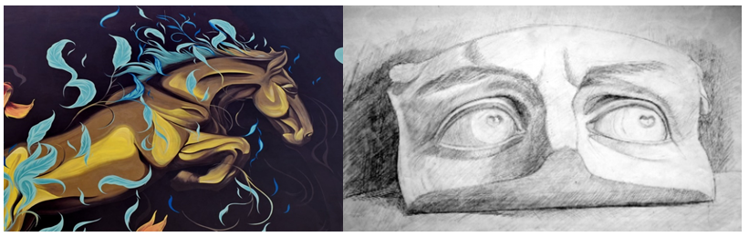

Час. Увод у рачунарску графику
==============================

.. infonote::
 
 На овом часу научићеш о:
    •	 појму рачунарске графике;
    •	 принципима растерске и векторске графике;
    •	 моделима приказа боја;
    •	 форматима записа слика.

Визуелно представљање информација помоћу боја и облика, тачније слике у циљу информисања, илустровања или забаве називамо **графиком**. Коришћењем графике информације можемо да представимо на некој подлози, као што су зид, платно или папир, али и на екрану дигиталног уређаја.

Неки од примера су: фотографије, цртежи, графикони, дијаграми, симболи, геометријски облици, карте или слично. 
Сви ови примери често се користе као визуелна замена за текст ради лакшег разумевања неког концепта или да га учине занимљивим, комбинујући при томе текст, илустрацију и боју.

Слике које настају или се приказују уз помоћ дигиталних уређаја називају се **рачунарска графика**. Она обухвата обраду, стварање и чување сликовног (графичког) садржаја помоћу рачунара. Тачније, рачунарска графика припада визуелној уметности где корисник путем рачунара креира слике и визуално их мења вршећи истовремено њихову комбинацију са информацијама и материјалима из реалног света. Појавом персоналних рачунара почео је и убрзани развој рачунарске графике.

Данас се рачунарска графика користи у различитим подручјима свакодневног живота од индустрије, едукације, забаве,…. 

Графику на рачунару, можемо поделити према начину на који се у меморији памте подаци о слици, тачније према основним градивним елементима слике. 
Постоје два веома различита начина дигиталног записа слика, позната као **растерска графика**, код које програм памти боју сваког појединачног пиксела слике и **векторска графика**, код које се памте геометријски облици из којих се слика састоји.

Растерска графика
------------------

Основни градивни елемент растерске графике је **пиксел**. 
Пиксел је најмањи део слике који има јединствене вредности боје и/или интензитета (нивоа) осветљености. Код нас се израз пиксел често преводи као тачка. Број пиксела одређује квалитет дигиталне слике. Тако да растерска слика представља слику састављену од пиксела (тачака) различитог нивоа осветљености (монохроматске слике) или различитих боја (колор слике). 

Тачније, слика је састављена од матрице појединачних пиксела, од којих свака има своју боју (боја се одређује битовима, најмањом могућом јединицом информације у рачунару). 

Представљање боја 
------------------

Два најзначајнија модела за представљање боја помоћу бројева су **адитивни модел RGB** и **суптрактивни модел CМYК**. 

**RGB** или **адитивни модел** заснива се на особини светлости да се боја може добити комбиновањем (сабирањем) три основне боје: црвене (енгл. red), зелене (енг. green) и плаве (енг. blue). Одсуство све три компоненте даје црну, док максимално присуство све три компоненте даје белу боју. 

.. image:: ../../_images/L31S3.png
    :width: 500px
    :align: center

Овај модел боја се користи код уређаја који приказују слику емитовањем светлости као што су монитори или пројектори. Ниво сваке светлосне компоненте записује се бинарно, односно бројем. Ако посматрамо RGB модел који се састоји од три компоненте, црвене, зелене и плаве, онда се боја пиксела може записати помоћу три броја, за сваку компоненту боје по један. За сваку боју, овај број се креће између броја који означава минималну и броја који означава максималну вредност обојености пиксела том бојом. Боја сваког пиксела дефинисана је бројним вредностима од 0 до 255 (од 0 до 100% концентрација боје). На пример, (255, 0, 0) представља црвену боју – концентрација црвене боје је 100%, док је концентрација зелене и плаве 0%. Слично томе (0, 255, 0) представља зелену боју, а (0, 0, 255) плаву боју.

.. image:: ../../_images/L31S4.png
    :width: 500px
    :align: center

Овако записани бројеви (бројеви битова) чине **дубину боје** која одређује број различитих нивоа светлосне компоненте, тачније укупан број различитих нијанси боје које је могуће представити. Данас се најчешће користи дубина TrueColor која подразумева по 1 бајт за сваку од три RGB компоненте. С обзиром на то да 1 бајт садржи 8 битова, jедним бајтом могуће је представити 28 = 256 различитих боја. Вредност једног пиксела се представља са 3 бајта (и то по један бајт за сваку од RGB боја), тако да број боја по сваком пикселу износи 256х256х256= 16.777.216 различитих нијанси. 

Дубина боје је важна карактеристика сваке растерске слике и изражава се или у **броју бита за опис боје** или у **броју боја које се могу приказати**. Ако је дубина боје већа, више се нијанси може приказати, што значи да тиме добијамо бољу слику као и веродостојнији приказ исте. Данас су у употреби формати растерских слика са 1 (2 боје), 4 (16 боја), 8 (256 боја), 16 (64К боја), 24 (16М боја) или 32 (4G боја) бита по пикселу за опис боје. 

Растерске слике се према броју боја деле на четири основне категорије: 
•	Монохроматски растери (битмапе) - слике које се састоје од само две боје. Обично се користе црна и бела боја, али могућа је и комбинација било које друге две боје. Рачунар користи само један бит за сваки пиксел. 
•	Grayscale растери - слике у којима сваки пиксел може да прими било коју боју из скале сивих нијанси, од црне до беле боје. Овај тип слике зависи од броја сивих тонова у скали између црне и беле боје као и од њихове расподеле у тој скали. Данас се најчешће користи скала од 256 сивих тонова (рачунајући и белу и црну боју). За чување 256 нијанси сиве боје потребно је обезбедити по 8 бита (1 бајт) за сваки пиксел. 
•	Вишебојни растери – слике које садрже нијансе две или више боја. 
•	Колор растери - сваки пиксел у слици може примити било коју боју из неког дефинисаног скупа боја. 

Ако желимо да направљену дигиталну слику користимо за штампање, потребно је да користимо суптрактивни CMYK модел. Oсновне боје које се користе су цијан који упија црвену светлост, магента која упија зелену светлост, жута која упија плаву светлост и црна боја. 

Овај модел заснива се на појави да пигмент боје премазан на папир не емитује светлост, већ супротно, упија светлост одређене боје, а око види само светлост која се одбила. Зато се у штампи не користе црвена, зелена и плава, већ цијан, магента и жута. Цијан тачкица на папиру упија црвено светло, а одбија једнаке количине зеленог и плавог светла. Жута боја упија плаво светло, а одбија црвено и зелено док магента упија зелено светло, а одбија црвено и плаво. Због тога се овај модел назива суптрактивни, јер свака од основних боја у штампи (цијан, магента, жута) одузима једну од основних боја (црвена, зелена, плава). Када се помешају све три боје (цијан, магента, жута) у једнаким количинама требало би да се добиje црна боја. Ипак, не добија се, већ се добија црвено-смеђа боја. Због тога се у CMYK моделу уводи и четврта боја – црна боја. 

Kвалитет растерске слике је одређен резолуцијом и бројем могућих нијанси боје за сваки појединачни пиксел (дубина боје). 

**Резолуција** представља укупан број пиксела од којих је слика сачињена. Слика резолуције 800x600, значи да она има укупно 480 000 пиксела који су распоређени у 800 врста и 600 колона. Још један параметар слике у вези са резолуцијом јесу њене пропорције (acepti ratio) које говоре о односу ширине и висине слике. Раније су резолуције LCD екрана биле углавном у пропорцији 4:3 (нпр. 1024x768 или 1280x960), док се данас користе и резолуције у пропорцији 16:9 (нпр. 1366x768). Телевизија високе резолуције (HDTV) има слику резолуције 1920x1080. 

Питање:
~~~~~~~

.. fillintheblank:: L31P1

    На дигиталном уређају сачувана је доња слика која има следеће димензије 2048x1152. Колико пиксела има по висини горња слике? 

    Одговор: |blank|

    - :1152: Тачно
      :x: Одговор није тачан.

.. fillintheblank:: L31P2

    Колико пиксела има по ширини горња слике? 
    
    Одговор: |blank|

    - :2048: Тачно
      :x: Одговор није тачан.

.. fillintheblank:: L31P3

    Колика је укупна резолуција у мегапикселима. Унеси вредност користећи за запис са две десимале иза децималне тачке.

    Одговор: |blank|

    - :2.25: Тачно
      :x: Одговор није тачан.

Резолуција данашњих дигиталних фотоапарата обично се изражава у мегапикселима (милионима пиксела). Тако, резолуција од 10,1 мегапиксела подразумева да слика има око 10,1 милиона пиксела, тј. резолуцију од 3888x2592 пиксела (слика је обично у пропорцији 3:2). 

Резолуција се изражава у броју пиксела по јединици дужине – обично у **броју пиксела по инчу (ppi)**. Тако да стандардни LCD екрани обично имају резолуцију око 100 ppi. На пример, монитор дијагонале 15,4 инча који приказује слику резолуције 1280x960 пиксела има резолуцију 104 ppi. 
Као што је већ речено, резолуција је број пиксела по мерној јединици, обично  инчу (2.54 cm). Резолуцијa слике добија се када се подели њена физичка димензија (ширина или висина) са бројем пиксела поређаних дуж те физичке димензије. 

Питање:
~~~~~~~

.. fillintheblank:: L31P4

    На пример, ако је слика ширине 16 cm, а висине 7.51 cm и има поређаних 454 пиксела по ширини и 201 по висини слике, онда је резолуција 454/16 или 201/7.51 = 26.764 пиксела по центиметру. Колика је резолуција ове слике израђена у пикселима по инчу? Унеси вредност користећи за запис са две десимале иза децималне тачке.

    Одговор: |blank|

    - :67.98: Тачно
      :x: Одговор није тачан.

Квалитет штампе обично се изражава у броју тачака по инчу (dots per inch, dpi). То је заправо густина тачака на основу којих штампач креира слику. Инкџет штампачи имају квалите 300 до 600 dpi, док ласерски обично имају од 600 до 1800 dpi. Билборди се штампају и са 45 dpi, новине са 85 dpi, а квалитетне књиге и новине са 150 dpi.

Што је већа резолуција, тачније што је већи број пиксела, то је квалитет слике бољи. Већа дубина боје подразумева вернији приказ слике, али захтева и више меморије. Када се растерска слика увећа, број пиксела се не мења, број остаје исти, а слика постаје мутна, јер долази до увећавања пиксела. Такође, велико смањивање слике доводи до губитка квалитета. 

Постоји велики је програма за прављење или обраду растерских слика. Од најпознатијих ту су Adobe Photoshop и Corel Photo-Paint, а од бесплатних ту је MS Paint, и GIMP итд. 

Већина ових програма користи RGB модел боја док неки дозвољавају употребу и других модела боја попут CMYK. 

Векторска графика
------------------

Код векторске графике, градивни елементи су праве и криве линије, отворени и затворени, испуњени и неиспуњени геометријски облици који могу да се преклапају, прекривају или уклапају креирајући на тај начин слику. 

Распоред објеката се може мењати исто као и њихов облик и величина, а да се при томе положај и карактеристике осталих делова слике не мењају. Овакве слике је лакше креирати, мењати и комбиновати са другим сликама. Векторска графика своју примену налази у програмима намењеним дизајнерима и свуда где је састављање слике од објеката природан начин визуализације стварног или измишљеног света. 

Као што знаш, сваки вектор има своју почетну тачку, смер и завршну тачку, дужину, ако је закривљен онда садржи и тачке које дефинишу кривуље или углове.

Векторском графиком креирамо геометријске облике круг, квадрат, троугао или друге облике… Када дигиталну слику увећамо она остаје оштра, тачније увећањем на било коју величину не губи се квалитет слике. Разлог томе је што се у процесу увећања геометријски облици поново исцртавају. Због тога је она идеална за логое предузећа, географске карте, билборде, којима је често потребно мењати величину.

Међутим, извесна ограничења:

•	код превеликог смањивања могу нестати танке линије. Тачније, оне ће и даље постојати али се не могу одштампати или приказати на екрану.
•	мале грешке могу постати приметне кад се слика пуно увелича.
•	многи програми омогућавају да се у векторској графици користе и растерска графика. 

Због свега горег наведено, пре или касније, сва векторска графика мора бити пребачена у растерску како би била приказана на дигиталном монитору. 

Постоји велики је програма за прављење или обраду векторске слика. Од најпознатијих ту су Corel Draw и Adobe Illustrator, а од бесплатних ту је Inkscape. 

Типови графичких датотека
--------------------------

Снимљене слике коришћењем савремених дигитални уређаји, који имају камере високе резолуције заузимају велику количину меморије. Тако на пример, дигитални фотоапарати резолуције 12 мегапиксела (12.000.000 пиксела) код којих се користи 24-битна дубина боје формирају слике чије датотеке заузимају 36 MB меморије.

Да би се смањила количина меморије коју сачувана слика заузима на дигиталном уређају развијене су различите технике компресије дигиталне слике. Приликом компресије се не мења број пиксела који чини слику, већ се мења начин на који се слика припрема за чување, при чему квалитет слике директно зависи од степена и начина компресије. 

Најчешће коришћене компресије дигиталне слике су:

•	компресија без губитака (lossless) – врши се смањење величине датотеке без смањења квалитета слике, а то значи да се компримована слика може декопмримовати тако да буде идентична оригиналу. Ова врста компресије се користи се кад је квалитет слике важнији од величине датотеке. 
•	компресија са губитком података (lossy) - врши се смањење величине датотеке тако да се неки подаци губе приликом декомпресије, зато што се сматрају визулено небитним. Ово је тип компресије који користе ограничења људског ока тако да се са слике одбацују они делови података које око не региструје.

Формати растерских датотека 
----------------------------

Растерске датотеке се може чувати у великом броју формата. Формати записа растерских слика: 

Најчешће коришћени типови (формати) растерских  датотека су:

•	RAW формат записа фотографије у којем фотоапарат бележи све податке које је забележио и сам дигитални сензор фотоапарата (RAW значи сиров, необрађен). У овом формату нема компресије па ни редукције квалитета слике;
•	BMP (bitmap) формат слике је један од првих формата па се растерске слике често називају битмапиране слике. У датотеку се складишти сваки пиксел слике, са одговарајућим бројем бајтова који одређују боју. Нема компресије па ни редукције квалитета слике;
•	GIF (Graphics Interchange Format) формат је ограничен на 8-битну палету, односно 256 боја чиме се смањује количина података. Погодан је за чување графике са релативно мало боја као што су дијаграми, геометријски облици, и логотипи. Подржава анимације и  често се користи за приказ анимација на веб страници;
•	JPEG (Joint Photographic Experts Group) је компресовани формат слика са губицима. Заснива се на особини људског ока да боље уочава површине и облике него варијације у боји и осветљењу. Ово је најчешће коришћен формат у раду са сликама. Због мале количине меморије коју заузима налази примену у складиштењу слика, приказу слика путем интернета или размени путем електронске поште;
•	PNG (Portable Network Graphics) је формат за растерске слике који користи компресију без губитка. Подржава 24-битну дубину боја;
•	TIFF (Tagged Image File Format) формат користи 24-битну или 48-битну дубину боје, а екстензија за ове датотеке је TIFF или TIF. Користи се компресија без губитка, и зато је преовлађујући формат за велике слике које се користе за штампу великих плаката, високо квалитетних каталога и сл.

Формати векторских датотека 
----------------------------

Формати за чување векторских датотека углавном зависе од програма у којем је садржај датотеке направљен.

Најчешће коришћени типови (формати) векторских датотека су:

•	SVG (Scalable Vector Graphics) – формат намењени веб страницама;
•	PS (PostScript) и PDF (Portable Document Format) - формат који се користи за запис докумената намењених за читање на екрану и штампање. Подржава чување и растерских слика;
•	AI – формат који користи програм Adobe Illustrator;
•	CDR (CorelDraw) - формат који користи програм CorelDraw;
•	DWG или DHF (AutoCAD) - формат који користи програм AutoCAD

Претрага слике
--------------
 
Да се подсетимо, у претходним разредима вршили смо на интернету претрагу за сликама према праву коришћења, затим их преузимали и чували на локалном рачунару.

На доњој слици приказан је поступак проналажења и преузимања слике са интернета (1. уношење кључне речи; 2. избор права коришћења; 3. отварање слике у новом табу; 4. чување слике на локални рачунар)

Осим према праву коришћења, слике можемо претраживати и према њиховој величини.

На доњој слици приказан je поступак проналажења слике „по величини“ на интернету (1. уношење кључне речи; 2. избор алатке; 3. избор величине слике „веће од“; 4. избор резолуције „1024х768“)

 
Избором опције Advanced search отвара се страница на којој спроводиш поступак проналажења слике „по величини“ на интернету (1. уношење кључне речи; 2. избор величине слике „веће од“, избор резолуције „1024х768“; 3. потврда избора величине слике „веће од“, избор резолуције „1024х768“;)

 
Након избора приказаће нам се слике чија је резолуција, у овом случају, већа од 1024х768.

.. image:: ../../_images/L31S7.png
    :width: 800px
    :align: center

.. infonote::

 **Укратко**
    •	Рачунарска графика је област рачунарства која се бави креирањем, обрадом, прилагођавањем слика и анимација помоћу рачунара.
    •	Растерска слика не може се увећати без губитка квалитета.
    •	Пиксел (енгл. pixel, скраћено од picture element, део слике) је најмањи елемент дигиталне слике који се може обрађивати.
    •	Резолуција је основна мера за оштрину неке слике и дефинише се као број пиксела на екрану.
    •	Дубина боје одређује укупан број различитих нијанси боје које се могу представити.
    •	RGB (Red, Green, Blue) модел приказа боја је адитивни метод стварања слике који се заснива на комбиновању (сабирању) светлости три основне боје.
    •	CMYK (енгл. Cyan, Magenta, Yellow, Key (Black)) модел  приказа боја назива се и суптрактивни, јер свака од основних боја у штампи (цијан, магента, жута) одузима једну од основних боја (црвена, зелена, плава).
    •	Векторска графика представља начин приказивања слике помоћу објеката (геометријских облика).
    •	Да би се смањила количина меморије потребна за чување слика развијене су различите технике компресије дигиталне слике.
    •	Векторска графика може се неограничено увећавати без губитка квалитета. 
    •	Најчешће коришћени типови (формати) растерских датотека су: RAW, BMP, GIF, JPEG, PNG, TIFF.
    •	Најчешће коришћени типови (формати) векторских датотека су: SVG, PDF, CDR, DWG.
