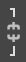

Квиз. Оптимизација слике за штампање и ради објављивања на интернету
====================================================================

Питање 1.
~~~~~~~~~

Дата је слика димензије 2736x3648, резолуције 96ppi. 

.. image:: ../../_images/Slika3.jpg
    :width: 400px
    :align: center

Преузми слику са линка. Отвори је у програму Gimp 2.

Смањи слику на 700 пиксела по дужини.

.. fillintheblank:: L33P1

    Колика је димензија слике по висини, ако је одабрана опција |а1|? 

    Одговор: |blank|

    - :933: Тачно
      :x: Одговор није тачан.

.. fillintheblank:: L33P2

    Колика је димензија слике по висини, ако је одабрана опција |а2|? 

    Одговор: |blank|

    - :3648: Тачно
      :x: Одговор није тачан.

Питање 2.
~~~~~~~~~

.. fillintheblank:: L33P3

    Како се назива поступак којим дигиталну слику подешаваш својим потребама? Унеси одговор малим словима ћириличким писмом.

    Одговор: |blank|

    - :оптимизација: Тачно
      :x: Одговор није тачан.

Питање 3.
~~~~~~~~~

.. fillintheblank:: L33P4

    Која је најчешћа резолуција (ppi) слика које се објављују на интернету? 

    Одговор: |blank|

    - :72: Тачно
      :x: Одговор није тачан.

Питање 4.
~~~~~~~~~

.. fillintheblank:: L33P5

    Која је најчешћа резолуција (ppi) слика које су припремљене за штампу? 

    Одговор: |blank|

    - :300: Тачно
      :x: Одговор није тачан.