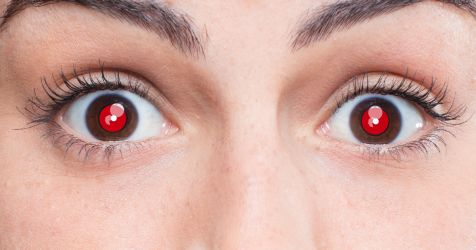
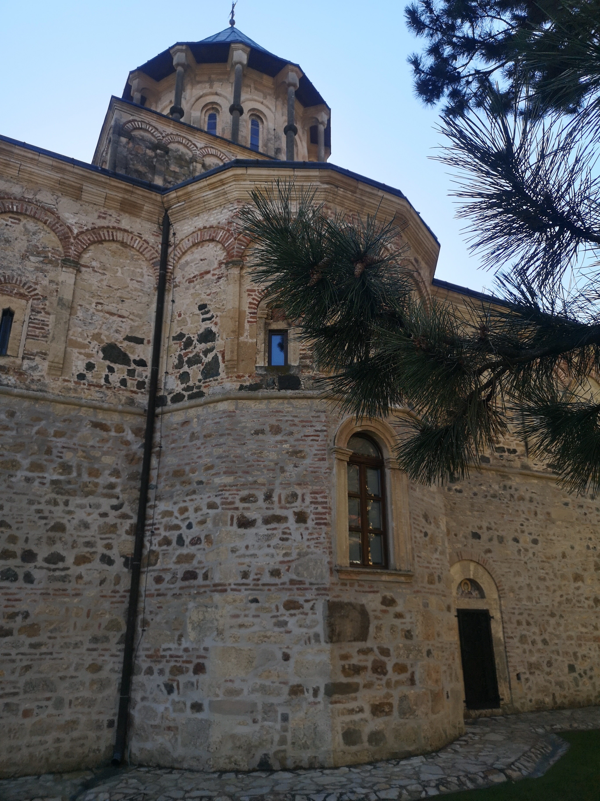

Час. Практична вежба
=====================

Практична вежба 1.
~~~~~~~~~~~~~~~~~~

Преузети слику са линка: 

Сачувај је под именом Очи. 

Отвори ову слику у програму Gimp 2.

На датој слици уклони појаву црвених очију, која се појављује приликом упорабе блица фотоапарата.

Мала помоћ: Примени филтер Red Eye Removal.

Сачувај нову слику под именом ОчиИсправљено.

Практична вежба 2.
~~~~~~~~~~~~~~~~~~

Преузети слику са линка: 

Сачувај је под именом Манастир. 

Отвори ову слику у програму Gimp 2.

На датој слици примени ефекте тако да на слици само манастир буде црно-беле боје. 
Промени димензије слике на 900x900. 

Сачувај нову слику под именом МанастирИсправљено.

Практична вежба 3.
~~~~~~~~~~~~~~~~~~

Преузети слику са линка: 

.. image:: ../../_images/Slika5.jpg
    :width: 600px
    :align: center

Сачувај је под именом Споменик. 

Отвори ову слику у програму Gimp 2.

Користећи неки од алата за селекцију селектуј део језера.
Из менија Colors изабери  подешавање Color Balance → Midtones и помери вредност клизача Yellow у крајњи леви положај. 

Сачувај нову слику под именом СпоменикИсправљено.

