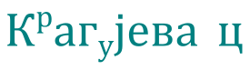

Вежбаоница. Цртање основних графичких елемената
================================================

.. infonote::
 
 Вежбаоница је место где ћеш имати прилику да провежбаш:
    •	 креирање векторске слику у одабраном програму;
    •	 употребу алатки за цртање основних графичких елемената;
    •	 коришћење алатки за креирање текста.

Вежба 1.
~~~~~~~~

Отвори нов документ у програму Inkscape;
Подеси величину странице на A4 и оријентиши је тако да буде постављена вертикално.
Постави мрежу са почетком у 0,0, јединицу мреже у милиметрима и размак између линија 5 милиметара.

Сачувај документ.

Вежба 2.
~~~~~~~~
Отвори документ из претходног задатка (Вежба 1.) 
Напиши текст Крагујевац, коме је фонт Cambria, величина 80px, боја зелена, примењена опција за постављање слова у индексу и експонету, као и размак између слова 30.
Тако да изгледа као на слици:

 
Сачувај документ.

Вежба 3.
~~~~~~~~

Отвори нов документ у програму Inkscape;
Подеси величину странице на A4 и оријентиши је тако да буде постављена хотизонтално. 
Користећи алатку Calligraphy (Калиграфија) напиши своје име. 

Сачувај документ.

Вежба 4.
~~~~~~~~

Отвори нов документ у програму Inkscape;
Подеси величину странице на A4 и оријентиши је тако да буде постављена хотизонтално. 

Уради следеће задатке:

-  Нацртај правоугаоник са страницама 3,5 cm и 5 cm.
-  Линија правоугаоника треба да буде дебљине 4mm плаве боје.
-  Унутрашњост правоугаоника треба обојити неком шрафуром.

Сачувај документ.

Вежба 5.
~~~~~~~~

Отвори нов документ у програму Inkscape;
Подеси величину странице на A4 и оријентиши је тако да буде постављена хотизонтално. 

-  Нацртај квадрат са страницом 9cm.
-  Линија квадрата треба да буде дебљине 2mm плаве боје.
-  Унутрашњост квадрата треба попунити неком текстуром.
